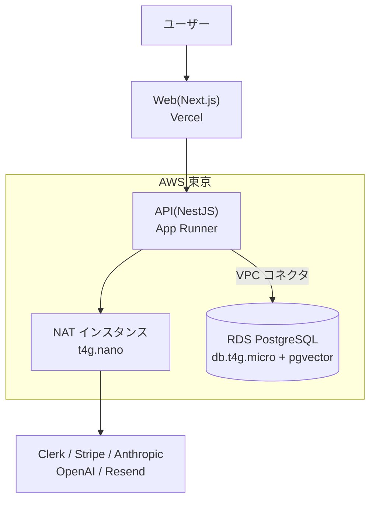

個人開発で B2B SaaS を作って公開しました。技術選定の記事はたくさんありますが、たいてい**選んだ時点で終わっています**。選定の答え合わせは、その構成で本番を立ち上げて請求書を見てからしかできません。

この記事は、選定 → 実装 → 本番構築まで通した記録です。**何を選んだかより、何を捨てたか**と、**選定時の想定と実際のズレ**を中心に書きます。

題材は [Neorie](https://neorie.com) という SaaS です。個人開発者と小規模チーム向けに、アイデア検証・プロダクト診断・README / LP / 告知文の AI 生成をまとめたツールで、マルチテナント・サブスク課金・AI 生成が一通り入っています。ただし**プロダクトの紹介ではなく、選定を語るための具体例**として扱います。テナント分離や AI 課金の実装寄りの話は前の記事(「個人開発で B2B SaaS を作るなら先に知りたかった、マルチテナント・RAG・AI 課金の設計判断 6 つ」)に書いたので、こちらは「なぜその技術なのか」に絞ります。

材料として、設計判断は **ADR**(Architecture Decision Record = 決定の背景・検討した選択肢・採用理由・棄却理由を 1 ファイルにまとめたもの)で 14 本残してあります。この記事は、そこに書いた選定時の想定と、本番を立ち上げたあとの実際を突き合わせたものです。

:::message
本記事の金額・無料枠は執筆時点(2026 年 8 月)に確認した概算です。他社サービスの仕様は公開情報を参照した範囲の記述で、料金改定で変わります。
:::

## 1. 前提を先に置く

制約を書かない選定記事は一般論になります。この選定は次の条件下で行いました。

| 条件           | 内容                                                       |
| -------------- | ---------------------------------------------------------- |
| 開発体制       | 1 人。レビュアーも運用当番もいない                         |
| 初期スコープ   | 3 週間で MVP(当時の想定)                                   |
| 公開後の可処分 | 週 12 時間(本業の合間)                                     |
| 収益           | 公開時点でゼロ。固定費は全額持ち出し                       |
| 必須要素       | マルチテナント / サブスク課金 / AI 生成 / 独自ドメイン運用 |

「1 人で、週 12 時間で、赤字を垂れ流さずに運用し続けられるか」が全ての前提です。技術的な優劣より、**手離れの良さと固定費**が効きます。

### 判断軸

軸を先に固定して、各技術をこれで評価しました。

1. **学習コスト** — 3 週間の予算を実装に全振りできるか。新しく覚える対象を増やさない
2. **運用の手離れ** — 週 12 時間で面倒を見られるか。自分で守るものを増やさない
3. **月額フロア** — ユーザーがゼロでも毎月出ていく額をいくらに抑えられるか
4. **撤退のしやすさ** — 判断を間違えたときに、どれくらいの手数で乗り換えられるか

### 正直に書いておく第 5 の軸

このプロジェクトには**副業面談で語れる経験を残す**という目的もありました。純粋な合理性だけの選定ではありません。後述する IaC とインフラの選定は、この軸が入らなければ別の結論になっています。

隠すと選定の理由が説明できなくなるので、明示しておきます。

---

## 2. 軸ごとの採用と却下

主要な決定を一覧にします。「捨てたもの」と、いま振り返っての「その後」の列が本題です。

| 領域     | 採用                      | 軸         | 捨てた選択肢                         | 捨てたもの                       | その後                    |
| -------- | ------------------------- | ---------- | ------------------------------------ | -------------------------------- | ------------------------- |
| フロント | Next.js 15(App Router)    | 学習コスト | Remix / Astro + Solid                | Vercel 以外へ移す容易さ          | 想定どおり                |
| UI       | Tailwind + shadcn/ui      | 学習コスト | MUI / Chakra / Mantine / Tailwind 素 | 自動アップデート追従             | 想定どおり                |
| バック   | NestJS 11 + Prisma 6      | 学習コスト | Hono + Drizzle / Go + Echo           | 記述量の少なさ(DI のお作法)      | 想定どおり                |
| DB       | PostgreSQL + pgvector     | 手離れ     | Pinecone / Qdrant                    | 専用ベクトル DB のスケール性能   | 想定どおり                |
| 認証     | Clerk                     | 学習コスト | Auth.js / Supabase Auth / 自前       | 認証 UI の自由度、MAU 課金リスク | 想定どおり                |
| 決済     | Stripe                    | 情報量     | Lemon Squeezy / Paddle               | 海外売上の納税代行(MoR)          | 想定どおり                |
| メール   | Resend                    | 初速       | Postmark / AWS SES                   | 大量送信時の単価                 | 落とし穴が 1 つ(4.6)      |
| キュー   | Redis + BullMQ            | 手離れ     | SQS + Lambda / RabbitMQ / Step Fn    | 最安のランニングコスト           | **結局使わなかった(4.1)** |
| IaC      | Terraform                 | 第 5 の軸  | AWS CDK / CloudFormation             | TypeScript との統合              | 想定どおり                |
| モノレポ | Turborepo + pnpm          | 学習コスト | Nx / Lerna / Rush / Polyrepo         | ワークスペースの見通しの良さ     | **型同期が効かず(4.2)**   |
| インフラ | Vercel + App Runner + RDS | 月額フロア | ECS + Aurora / フル PaaS             | ECS の経験、NAT の冗長性         | **フロアが見積超え(4.3)** |

太字の 3 つが外れた選定で、§4 で詳しく書きます。まずは**却下理由が面白かった 3 つ**を掘ります。

### 認証: Clerk

自前実装で最低 3 日、Clerk なら 30 分。3 週間スコープでは検討に値しませんでした。

捨てたのは 2 つです。**1 つは認証画面の自由度**で、`<SignIn />` を置くだけで完成する代わりに細かい制御は諦めます。**もう 1 つは MAU 課金の将来リスク**で、無料枠を超えた瞬間にフロアが跳ねます。

代替の却下理由は次のとおりです。

- **Auth.js**: プロバイダ設定・セッション戦略・DB アダプタを自分で組む必要があり、**サインイン / サインアップ画面も自前**です。選定時に触った限りでは、そこまでで半日〜1 日かかる想定でした。「30 分」の優位が消えます
- **Supabase Auth**: 認証だけ単体で使うこともできます。ただし DB は AWS(RDS)に置く方針だったので、**認証のためだけに運用対象のプラットフォームをもう 1 つ増やす**形になります。軸 2(運用の手離れ)で見ると割に合いませんでした
- **自前実装**: 時間とセキュリティリスクが過大。1 人で守り続ける対象を増やす判断は、軸 2 に真っ向から反する

軸 4(撤退のしやすさ)は弱めですが、Clerk の Webhook を受けて自前 DB 側にもユーザー行を作っているため(認証は Clerk、ユーザーに紐づくデータは自前 DB という分担)、認証だけ差し替える余地は残しています。

### メール: Resend

比較表を作った時点で、料金だけ見れば SES が最安でした。それでも外したのは**初期摩擦**です。

| 候補     | 料金・無料枠(選定時に確認)    | 外した理由                                      |
| -------- | ----------------------------- | ----------------------------------------------- |
| Resend   | 無料枠 100 通/日・3,000 通/月 | 採用                                            |
| Postmark | 実質有料($15/月〜)            | 無料枠がテスト用のみ。MVP に固定費が乗る        |
| AWS SES  | $0.10 / 1,000 通(最安)        | **Sandbox 解除の審査が MVP のブロッカーになる** |

新規 SES アカウントは Sandbox に置かれ、事前に登録した宛先にしか送れません。**招待メールは不特定の宛先に送る機能**なので、Sandbox 中は機能そのものが成立しません。解除申請の審査期間は読めず、スプリントのクリティカルパスに他社の審査待ちを差し込むことになります。

一方で「単価の安さ」はいずれ効いてきます。そこでアプリ側は `MailService` という自前のインターフェースだけを知る形にし、その実装を Resend 版から SES 版に差し替えれば移行が済むようにしました。**軸 1(学習コスト・初速)で選び、軸 4(撤退のしやすさ)を抽象化で買った**という整理です。

### IaC: Terraform

ここは軸 1 に**あえて反した**選定です。

既存が pnpm + Turborepo の TypeScript モノレポなので、素直に考えれば AWS CDK です。`tsconfig` も ESLint も共有でき、L2 construct が VPC 一式を数行で吐き、state は CloudFormation 側が持つのでバックエンドの準備すら不要です。学習コストは明らかに CDK が低い。

それでも Terraform にしたのは、第 5 の軸(汎用スキルとして残るか)を優先したからです。**HCL の学習と state バックエンドのブートストラップという初回一度きりのコストを払って、AWS 以外にも通用する経験を取りました。**

CloudFormation は最初から候補外です。YAML の冗長さと再利用性の低さに対して、CDK がある以上は生で選ぶ理由がありません。

---

## 3. インフラは 1 回作り直した

当初の構成は ECS Fargate + Aurora Serverless v2 + ElastiCache + ALB でした。AWS の王道です。

見積もったフロア(ユーザーがゼロでも毎月かかる固定費)が**月 $90〜130**。収益ゼロの個人開発でこれは、有料ユーザーが 6 人前後つくまで赤字が続く水準です。本番構築に着手する直前で組み替えました。

| レイヤ | 変更前               | 変更後                            |
| ------ | -------------------- | --------------------------------- |
| Web    | —                    | Vercel(据え置き)                  |
| API    | ECS Fargate + ALB    | **App Runner**                    |
| DB     | Aurora Serverless v2 | **RDS `db.t4g.micro`**(Single-AZ) |
| Redis  | ElastiCache          | **Upstash**(外部 SaaS、後述)      |
| 外向き | NAT Gateway          | **NAT インスタンス**(`t4g.nano`)  |

Aurora Serverless v2 は最小 0.5 ACU でも月 $40 を超え、`db.t4g.micro` より高くつきます。NAT Gateway は単体で月 $35 以上。**フロアの差はおおむね月 $60〜100** で、MVP 段階では可用性とスケール能力にその額を払っている状態でした。

一方でフル PaaS(Neon + Fly.io など)まで倒すと AWS 要素がほぼ消えて第 5 の軸を失うので、中間に着地させています。**捨てたのは ECS の経験とマネージド NAT の冗長性**で、NAT インスタンスが単一障害点であることは承知のうえで受け入れました(壊れたら Terraform で作り直す)。

組み替え後の構成はこうなりました。



この構成でフロアは**月 ~$26** と見積もりました。**ただしこの数字は、本番を作ったあとに外れます。**(4.3)

---

## 4. 作って、本番に載せてどうだったか

ここからが本題です。実装と本番構築を通して、選定時の想定と実際がどうズレたかを書きます。

:::message
先に断っておくと、**答え合わせできているのは「選定 → 実装 → 本番構築」までの区間**です。開発に約 3 か月かかった一方、公開してからはまだ 2 週間ほどで、長期運用の答え合わせはこれからになります。AWS の初期クレジットが尽きて実費が立ち上がるのも、この記事の時点ではまだ先(11 月頃の見込み)です。
:::

### 4.1 選んだのに、一度も使わなかったものがある

ADR には Redis + BullMQ の選定理由が丁寧に書いてあります。SQS + Lambda・RabbitMQ・Step Functions と比較し、TypeScript ファーストで NestJS 統合が綺麗だから採用、と。

**公開時点で、`apps/api` に `bullmq` も `ioredis` も入っていません。** 依存も環境変数も実装もゼロで、Upstash の契約すらしていません。AI 処理も告知配信も同期実行で足りてしまい、キューを入れる必要が最後まで来ませんでした。

同じことがモノレポでも起きています。共有ライブラリ用に `packages/ui`(共通 UI)と `packages/types`(フロント ↔ バック共有の型)を先に切りましたが、**中身は `package.json` だけの空のワークスペース**のままです。

```
apps/
├── web/      # Next.js(フロント)
└── api/      # NestJS(バックエンド)
packages/
├── db/       # 実際に使っている(Prisma スキーマ + Client)
├── types/    # package.json のみ = 空
└── ui/       # package.json のみ = 空
```

どちらも「将来必要になる」を根拠に選定・作成したものです。**必要になるまで選ばなくてよかった**というのが素直な感想で、少なくとも比較検討に時間を使う必要はありませんでした。

### 4.2 モノレポの型同期は、自動では効かなかった

Turborepo を選んだ最大の理由は「フロント ↔ バック間の型を共有し、API の仕様変更をビルドエラーで検知できる」ことでした。ADR にもそう書いています。

実際にどうなったか。フロント(`apps/web`)は `packages/db` にも `packages/types` にも依存していません。代わりに、フロント側だけで使う型定義ファイル `apps/web/src/lib/api/types.ts` が**1,058 行あります**。

```ts
// API レスポンス型(apps/api のレスポンス shape と一致させる)。
//
// TODO(packages/types): 以下の enum 文字列群は packages/db の Prisma enum と
// 一致させる必要がある。本来は packages/types 共通化が望ましいが、apps/api 側で
// 並行作業中のため衝突回避を優先し、現状は web 側で重複定義している。

/** メンバーロール(`Role` enum、packages/db/prisma/schema.prisma)。 */
export const ROLES = ['OWNER', 'ADMIN', 'DEVELOPER', 'REVIEWER', 'TESTER', 'VIEWER'] as const;
export type Role = (typeof ROLES)[number];
```

手で書き写したミラーです。`Role` を 1 つ増やしたらフロントも直す必要があり、直し忘れてもビルドは通ります。**モノレポにしたのに、型の整合は人間が保証している**状態です。

原因ははっきりしています。**モノレポは型を共有できる「置き場所」を提供するだけで、共有そのものはしてくれません。** 実装中は API 側と Web 側を並行で触るので、「今は衝突を避けたいから後で共通化しよう」が毎回勝ちます。1 人開発でも同じでした。

置き場所を用意する選定(Turborepo をどれにするか)より、**共有される形を強制する仕組み**(スキーマからの型生成など)を決めるほうが本質でした。ここは選定の粒度を間違えています。

### 4.3 フロアは「選定表に載っていない行」で膨らむ

§3 で見積もった軽量構成のフロアは月 ~$26 でした。本番構築後、Terraform に実際に書いたリソースと 1 つずつ突き合わせた結果は、**AWS 小計で月 $42〜48**。App Runner のサイズ調整と VPC Flow Logs の絞り込みを効かせて $36〜40 に落としています。**見積もりから 1.4〜1.5 倍**です。

差分は、選定時の比較表に**行として存在しなかったもの**でした。

| 項目                 | 月額    | 選定時に見落とした理由                                |
| -------------------- | ------- | ----------------------------------------------------- |
| Elastic IP           | $3.7    | NAT インスタンス本体($3.1)しか数えていなかった        |
| Secrets Manager      | $0.4    | 「シークレット 1 本」を費目として認識していなかった   |
| VPC Flow Logs        | $1〜4   | 監視の設定が従量課金だと思っていなかった              |
| Route53 ホストゾーン | $0.5〜1 | ドメインを取ることと DNS を持つことを分けていなかった |

金額としては小さいですが、**フロア $26 の見積に対して合わせて $6〜9** で、率で見ると無視できません。

さらに、**構成に付いてくる必須の相棒**を見落としていました。この構成の肝はここです(この $7.5 には上表の Elastic IP $3.7 が含まれます。内訳は本体 $3.1 + EBS $0.7 + Elastic IP $3.7 で、二重計上ではありません)。

```
App Runner から private subnet の RDS に繋ぎたい
  → VPC コネクタが必要
    → VPC コネクタを付けると外向き通信が全量 VPC 経由になる(宛先で分けられない)
      → Anthropic / OpenAI / Stripe / Resend に出るために NAT が必須
        → NAT インスタンス代 月 $7.5 が構造的に避けられない
```

「App Runner は安い」と「RDS は private subnet に置く」を別々に評価したので、この連鎖が見積に入っていませんでした。**選定は単体で比較するが、コストは組み合わせで発生します。**

なお NAT を消す案(RDS を public 化)も検討して却下しています。App Runner の外向き IP は固定できないため、セキュリティグループを `0.0.0.0/0` で開けることになるからです。$7.5 のために DB をインターネットに晒す取引は割に合いません。

### 4.4 クレジットは「AWS の請求」しか消さない

新規 AWS アカウントの初期クレジットは、本プロジェクトでは実績 $140 でした(内訳は無料枠 $100 + チュートリアル完了で付く販促クレジット $40)。有効期限は 2027 年 7 月です。

期限まで 1 年近くあるので安心しかけましたが、実際は**残高のほうが先に尽きます**。

```
残高 $133.08 ÷ 月 $36〜40 ≒ 約 3.5 ヶ月
  → 2026 年 11 月頃に枯渇(有効期限より 8 ヶ月早い)
```

カレンダーに入れるべきは有効期限ではなく「枯渇の 1 ヶ月前」でした。

もうひとつ、より重要な誤解があります。**クレジットが打ち消すのは AWS の請求だけです。**

| 費目               | クレジット | 実態                                   |
| ------------------ | ---------- | -------------------------------------- |
| AWS 一式           | 対象       | クレジット期間中は実質 $0              |
| ドメイン登録料     | **対象外** | Route53 のドメイン登録料は一般に適用外 |
| Anthropic / OpenAI | **対象外** | 完全な実費。収益ゼロ期の主要な持ち出し |

実際、公開直後の請求は $17.60 で、内訳はドメイン代 $16 + 税でした。AWS の利用料はクレジットで消えているのに、請求はゼロになりません。

そして AI の原価は初月から出ていきます。公開前に自分で全機能を通しで確認した分、デモ用に生成した分、そして公開後はトライアルユーザーが使った分です。クレジットカード登録なしで試せるトライアルにしているので、**使われた分は回収できない原価**になります。

請求画面の見え方にも注意が要りました。クレジットが効いていると、サービス別の料金が `$0.00` に見えます。

```
Relational Database Service          USD 0.00
  ├ No Region              (USD 5.51)   ← 括弧 = 値引き
  └ Asia Pacific (Tokyo)    USD 5.51    ← 実際の利用料
```

Cost Explorer の `UnblendedCost` も値引き後を返すため、API から見ると項目が現れないことがあります。**素のコストを知るには請求書の行を展開する**必要がありました。

正しい理解は「クレジットがあるうちは運用費ゼロ」ではなく、**「赤字をクレジットで相殺している」**です。

### 4.5 ホスティングの選択は、後から追加した機能とぶつかる

Vercel を選んだのは開発体験のためで、選定時点で気にしていたのは月額とビルドの速さくらいでした。

その後、プロダクト診断とアイデア検証という機能を MVP に追加しました。Sonnet の 2 ターン呼び出し + Web Search Tool を使う機能で、**本番で実測した所要時間は 53〜113 秒**でした。

Vercel の関数実行時間の上限はプラン依存で、収益ゼロ期は Hobby で運用する方針です。本番構築の最終確認でこの数字を計測して初めて、**ホスティングの選択が機能の実現可能性に直接効いてくる**とわかりました。

現状はこう凌いでいます。

```
ブラウザ → Vercel の Server Action(maxDuration = 60 秒)
             → 自前の fetch ラッパー(55 秒でタイムアウト)
               → App Runner の API → Anthropic(SDK タイムアウト 180 秒)
```

Vercel に打ち切られる前に自分で 504 を返す形にしていますが、これは**打ち切っても API 側の処理は止まりません**。生成結果は保存され、AI クレジット(ユーザーに見せている月次の利用枠)も消費されます。そのため 504 のときの文言は「再実行」ではなく「再読み込み」を促すようにしています。

```ts
/**
 * apps/api へのリクエストを打ち切るまでのミリ秒。各ページの `maxDuration`(60 秒)より短くし、
 * Vercel の打ち切りより先に `ApiError(504)` として捕捉できるようにする。
 *
 * **打ち切っても API 側の処理は止まらない**(結果は保存され AI クレジットも消費される)。
 */
const API_TIMEOUT_MS = 55_000;
```

対症療法なので、非同期化(投げて後から結果を取る形)の判断基準をドキュメントに書いて先送りしています。**選定時に「この基盤で何秒まで待てるか」を確認していれば、機能設計の側で先に手を打てました。**

### 4.6 想定どおりだったもの

外した話ばかり書きましたが、当たった選定も並べておきます。

- **Clerk**: 「自前 3 日 / Clerk 30 分」はおおむねそのとおりでした。サインアップを Webhook で受けて自前 DB にユーザーを作る経路も素直に動きます
- **PostgreSQL + pgvector**: ベクトル検索を別サービスにしなかったことで、管理対象も請求先も増えませんでした。軸 2(運用の手離れ)と軸 3(月額フロア)の両方に効いています
- **Terraform**: HCL の学習コストと state のブートストラップは、想定どおり初回一度きりで済みました。`terraform plan` の差分が読めることの価値は、本番構築中ずっと効いていました
- **Resend**: 初日から招待メールが動きました。ただし**送信専用 API キーはドメインに紐づく**ため、ドメインを変更したときに再発行が必要になる、という細かい落とし穴はありました

なお、当初「3 週間で MVP」だったものが、公開までおよそ 3 か月かかっています。ただしこれは技術選定の失敗ではなく、LP 生成・プロダクト診断・告知配信などを途中で MVP 必須に格上げした、スコープ側の判断の積み重ねです。**選定は開発速度をあまり律速しませんでした。**

---

## 5. いま選び直すなら何を変えるか

### 変えること

**使う直前まで選ばない。** Redis + BullMQ の比較検討と、`packages/ui` / `packages/types` の作成は、そのまま丸ごと不要でした。「将来必要になりそう」を根拠に選定を始めない、というルールにします。

**型共有は「置き場所」ではなく「生成」で解く。** モノレポにしただけでは型は同期されませんでした。手で書き写す余地が残っている限り、締切のあるタイミングでは必ず手書きが勝ちます。この構成なら、具体的には次のどちらかを最初に通します。

- **OpenAPI 経由**: NestJS 側は `@nestjs/swagger` でスキーマを吐き、フロント側は `openapi-typescript` で型に落とす。DTO にデコレータを足す手間だけで、レスポンス型が生成物になる
- **スキーマ共有**: リクエスト / レスポンスを zod スキーマとして `packages/` 側に置き、API はそれで検証、フロントは `z.infer` で型を得る。バリデーションと型が 1 か所に寄る

前者は既存の NestJS の書き方をあまり変えずに済み、後者はバリデーションまで一本化できます。**どちらにせよ「生成物なので手で直せない」状態にすることが目的**で、ツールの優劣ではありません。

**構成に付いてくる必須の相棒を見積に入れる。** 「App Runner を選ぶと VPC コネクタが要り、VPC コネクタを付けると NAT が要る」のような連鎖は、単体の料金表を並べても見えません。選定表の各行に「これを選ぶと何が追加で必要になるか」の列を足します。

**プラットフォームの実行時間上限を、機能設計より先に確認する。** 数十秒かかる AI 機能を作るなら、ホスティングの上限は仕様の一部です。後から知ると対症療法しか残りません。

### 変えないこと

Clerk / Stripe / PostgreSQL + pgvector / Terraform / Resend、そして軽量 AWS 構成は、同じ制約ならもう一度同じものを選びます。

インフラを重量構成から組み替えた判断も含めてです。**フロアが月 $90〜130 の構成で公開していたら、クレジットが切れる前に赤字が問題になっていました。**

---

## まとめ

選定から本番構築までを一通り終えて残ったのは、**最初に立てた 4 つの軸のうち、実際にいちばん効いたのは軸 4(撤退のしやすさ)だった**という感覚です。選定の精度より、取り消しやすさのほうが効きます。

外した判断は必ず出ます。実際、キューは使わず、共有パッケージは空のままで、型同期の目論見は外れました。それでも詰まなかったのは、たまたま取り消しやすい形になっていた部分があったからです。メールはインターフェースを挟んでいたので移行先を残せましたし、テナント分離は Pool model(全テナントで DB を共有し、行に持たせた `tenantId` で分ける方式)なので、必要になったら重いテナントだけ別 DB に切り出す進化の余地があります。Vercel 固有の API も使っていないのでロックインは弱いままです。

逆に、取り消しにくいものだけは時間をかける価値がありました。マルチテナントの分離方式、課金と AI 原価の関係、そしてインフラのフロア。この 3 つは後から構造を入れ直すのが一番高くつきます。

そして最後に、**選定の答え合わせは請求書が来てからしかできません**。無料枠とクレジットで隠れているものが何なのかは、隠れが剥がれる前に一度確認しておくことをおすすめします。この記事の答え合わせにも続きがあって、クレジットが尽きて実費が立ち上がるのは 11 月頃の見込みです。そこでまた見積もりが外れていたら、追記します。

---

記事で扱った Neorie は公開しています。アイデア検証・プロダクト診断・README / LP 生成・告知文の生成までを 1 か所で回せます。新規登録から 7 日間、Pro の全機能をクレジットカード登録なしで試せます。

- サービス: https://neorie.com

インフラ構成やコストの詳細で「ここをもっと詳しく」があれば、コメントで教えてください。
