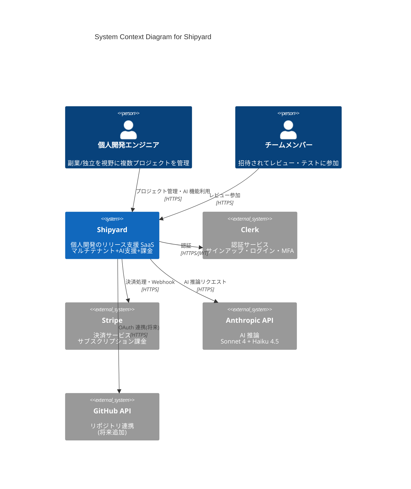
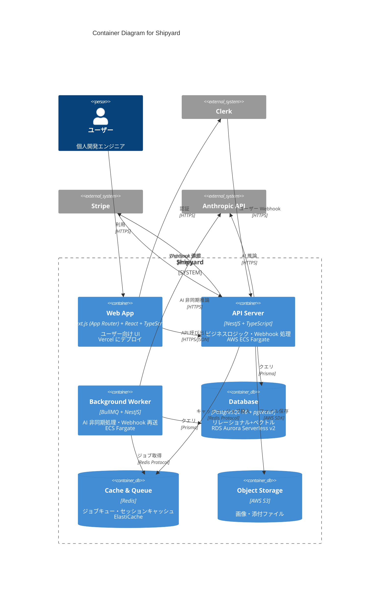
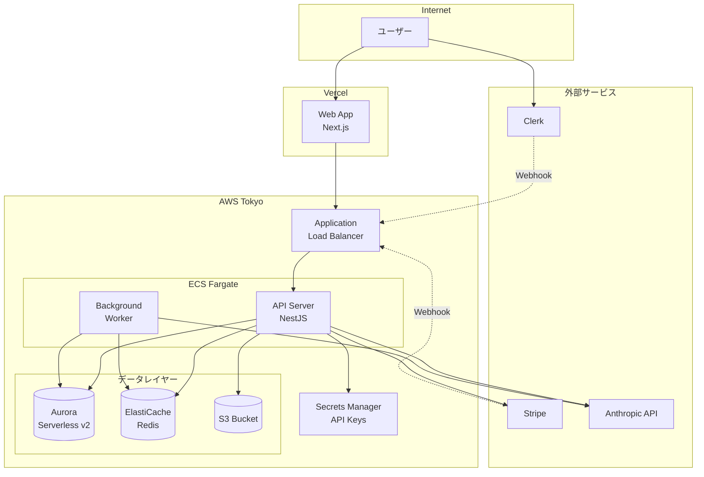

# アーキテクチャ設計

## 概要

C4 モデル(Context・Container)で Shipyard のシステム構成を可視化する。Component・Code レベルは省略し、必要に応じて個別の設計書で詳細化する。

## C4 Level 1: System Context

### 主要アクター

| アクター           | 役割                   | 主な操作                                              |
| ------------------ | ---------------------- | ----------------------------------------------------- |
| 個人開発エンジニア | ワークスペースの所有者 | プロジェクト作成、AI 機能利用、メンバー招待、課金管理 |
| チームメンバー     | 招待された協力者       | レビュー、コメント、限定操作                          |

### 外部システム

| システム      | 役割                     | 連携方式                                     |
| ------------- | ------------------------ | -------------------------------------------- |
| Clerk         | 認証・ユーザー管理       | JWT + Webhook(ユーザー作成/更新を DB ミラー) |
| Stripe        | 決済・サブスクリプション | Checkout Session + Webhook                   |
| Anthropic API | AI 推論                  | REST API、Tool Use 対応                      |
| GitHub API    | リポジトリ情報取得(将来) | OAuth + REST API                             |

## C4 Level 2: Container

### 各コンテナの責務

#### Web App(Next.js / Vercel)

- **責務**: ユーザー向け UI のレンダリング、認証統合、API 呼び出し
- **構成要素**:
  - App Router によるページ構成
  - Server Components で初期表示最適化
  - Client Components で対話的 UI(AI ストリーミング表示等)
  - Tailwind CSS + shadcn/ui でスタイリング
- **デプロイ**: Vercel(自動デプロイ、プレビュー環境)

#### API Server(NestJS / ECS Fargate)

- **責務**: ビジネスロジック、認証認可、データアクセス、外部 API 連携
- **構成要素**:
  - Controllers / Services / Repositories の DI 構造
  - Prisma Client Extension でテナント自動分離
  - Webhook 受信エンドポイント(Stripe / Clerk)
  - JWT 検証ガード
- **デプロイ**: ECS Fargate + Application Load Balancer

#### Background Worker(BullMQ / ECS Fargate)

- **責務**: 重い AI 処理の非同期実行、Webhook 再送、定期ジョブ
- **ジョブの例**:
  - 競合調査(Web 検索 + AI 分析、数十秒かかる)
  - 過去ドキュメントのベクトル化(Embedding 生成)
  - Stripe Webhook 失敗時のリトライ
  - 月次の AI 利用量集計
- **デプロイ**: API Server と同じ ECS タスク定義(別タスク)

#### Database(PostgreSQL + pgvector / RDS Aurora Serverless v2)

- **責務**: リレーショナルデータ + ベクトルデータ
- **特徴**:
  - Aurora Serverless v2 でアイドル時 0.5 ACU まで縮退、コスト最適化
  - pgvector で ProjectDocument の embedding を保存・検索
  - Pool model で全テナント共有、tenantId カラムで分離

#### Cache & Queue(Redis / ElastiCache)

- **責務**: BullMQ のジョブキュー、セッションキャッシュ、レート制限カウンタ
- **デプロイ**: ElastiCache(cache.t4g.micro で開始)

#### Object Storage(S3)

- **責務**: ユーザーがアップロードする画像、AI が生成した添付ファイル
- **アクセス制御**: テナント単位のプレフィックス、Pre-signed URL で配布

## デプロイ構成

## ネットワーク・セキュリティ

### ネットワーク分離

- **Public Subnet**: ALB のみ
- **Private Subnet**: ECS タスク、ElastiCache、RDS
- ECS から外部 API への通信は NAT Gateway 経由

### Secrets 管理

- API キー(Anthropic / Stripe / Clerk)は AWS Secrets Manager に保存
- ECS タスク定義からタスクロール経由で取得
- ローカル開発は `.env.local`(コミット禁止)

### CORS / CSRF

- Web App と API Server は別ドメイン構成(`shipyard.app` / `api.shipyard.app`)
- CORS は API 側で許可ドメインを明示
- CSRF 対策: Same-Site Cookie + JWT を Authorization ヘッダーで送る

## 監視・ロギング

### ログ集約

- ECS タスクログ → CloudWatch Logs
- Vercel ログ → Vercel ダッシュボード(必要なら Logflare 等にエクスポート)
- 構造化ログ(JSON)で出力、tenantId・userId・requestId を必ず含める

### モニタリング

- AWS CloudWatch メトリクス(CPU・メモリ・レイテンシ)
- アラーム: API のエラー率 5% 超、レイテンシ p99 > 2 秒
- Sentry でエラートラッキング(将来追加)

### コスト監視

- AWS Budgets で月次予算アラート設定
- AIUsage テーブルで Anthropic API コストを別途追跡

## 障害設計

### 主要な障害シナリオと対応

| 障害                 | 影響              | 対策                                                 |
| -------------------- | ----------------- | ---------------------------------------------------- |
| Anthropic API 障害   | AI 機能利用不可   | エラー画面で再試行を促す、別機能は継続稼働           |
| Stripe Webhook 遅延  | 課金状態のずれ    | Idempotency Key で重複処理防止、月次バッチで整合確認 |
| RDS フェイルオーバー | 数十秒の停止      | Aurora の自動フェイルオーバーに任せる                |
| ECS タスク異常終了   | 一時的な API 停止 | ALB ヘルスチェックで自動切替、最低2タスク稼働        |

## フォローアップ

- Vercel から ECS への通信レイテンシ計測(Day 7 以降)
- 本番デプロイ前の負荷試験計画(Week 3)
- Sentry / DataDog 等の有償ツールは Pro プラン契約後に検討
