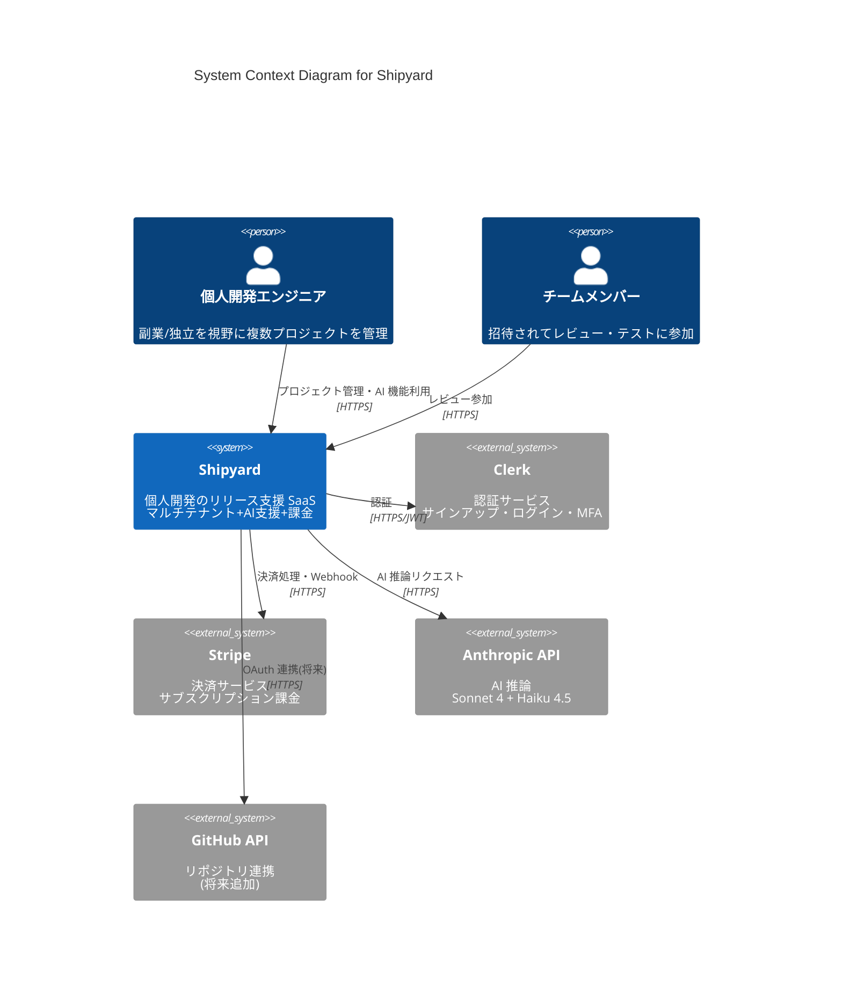
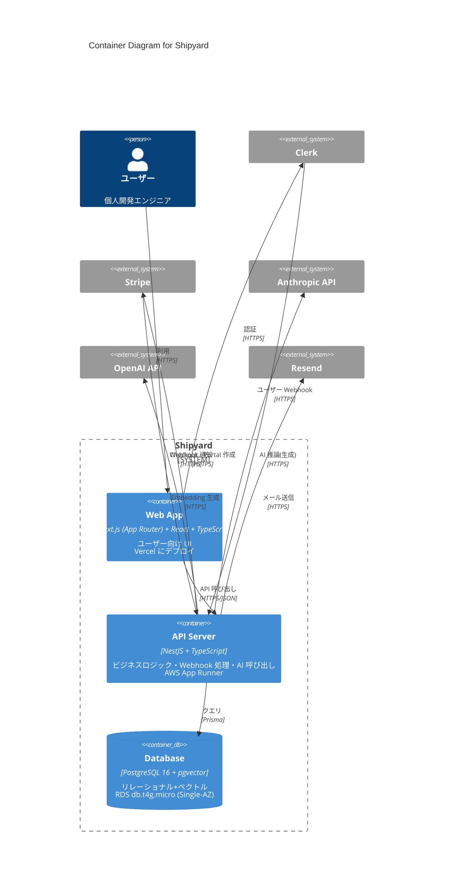
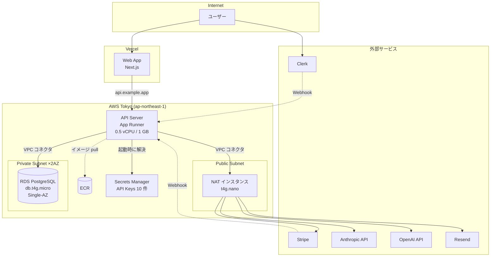

# アーキテクチャ設計

## 概要

C4 モデル(Context・Container)で Shipyard のシステム構成を可視化する。Component・Code レベルは省略し、必要に応じて個別の設計書で詳細化する。

> **最終更新: 2026-07-25。** 本番構成は [ADR-011「軽量 AWS 構成」](adr/011-lightweight-aws-architecture.md)(2026-05-22 承認)に準拠する。ADR-001 で想定していた **ECS Fargate + Aurora Serverless v2 + ElastiCache + ALB は採用していない**(収益ゼロ期の固定費をフロア月 ~$100〜130 → ~$26 に圧縮するため、**Vercel + App Runner + RDS `db.t4g.micro` + NAT インスタンス**へ組み替え)。ADR-001 のインフラ節は ADR-011 に置き換えられている。

## C4 Level 1: System Context

```mermaid
C4Context
    title System Context Diagram for Shipyard

    Person(indieDev, "個人開発エンジニア", "副業/独立を視野に複数プロジェクトを管理")
    Person(teamMember, "チームメンバー", "招待されてレビュー・テストに参加")

    System(shipyard, "Shipyard", "個人開発のリリース支援 SaaS<br/>マルチテナント+AI支援+課金")

    System_Ext(clerk, "Clerk", "認証サービス<br/>サインアップ・ログイン・MFA")
    System_Ext(stripe, "Stripe", "決済サービス<br/>サブスクリプション課金")
    System_Ext(anthropic, "Anthropic API", "AI 推論<br/>Sonnet 4 + Haiku 4.5")
    System_Ext(github, "GitHub API", "リポジトリ連携<br/>(将来追加)")

    Rel(indieDev, shipyard, "プロジェクト管理・AI 機能利用", "HTTPS")
    Rel(teamMember, shipyard, "レビュー参加", "HTTPS")
    Rel(shipyard, clerk, "認証", "HTTPS/JWT")
    Rel(shipyard, stripe, "決済処理・Webhook", "HTTPS")
    Rel(shipyard, anthropic, "AI 推論リクエスト", "HTTPS")
    Rel(shipyard, github, "OAuth 連携(将来)", "HTTPS")

    UpdateLayoutConfig($c4ShapeInRow="3", $c4BoundaryInRow="1")
```

### 主要アクター

| アクター           | 役割                   | 主な操作                                              |
| ------------------ | ---------------------- | ----------------------------------------------------- |
| 個人開発エンジニア | ワークスペースの所有者 | プロジェクト作成、AI 機能利用、メンバー招待、課金管理 |
| チームメンバー     | 招待された協力者       | レビュー、コメント、限定操作                          |

### 外部システム

| システム      | 役割                     | 連携方式                                     |
| ------------- | ------------------------ | -------------------------------------------- |
| Clerk         | 認証・ユーザー管理       | JWT + Webhook(ユーザー作成/更新を DB ミラー) |
| Stripe        | 決済・サブスクリプション | Checkout Session + Webhook                   |
| Anthropic API | AI 推論                  | REST API、Tool Use 対応                      |
| GitHub API    | リポジトリ情報取得(将来) | OAuth + REST API                             |

## C4 Level 2: Container

```mermaid
C4Container
    title Container Diagram for Shipyard

    Person(user, "ユーザー", "個人開発エンジニア")

    System_Boundary(shipyard, "Shipyard") {
        Container(webApp, "Web App", "Next.js (App Router) + React + TypeScript", "ユーザー向け UI<br/>Vercel にデプロイ")
        Container(apiServer, "API Server", "NestJS + TypeScript", "ビジネスロジック・Webhook 処理・AI 呼び出し<br/>AWS App Runner")
        ContainerDb(db, "Database", "PostgreSQL 16 + pgvector", "リレーショナル+ベクトル<br/>RDS db.t4g.micro (Single-AZ)")
    }

    System_Ext(clerk, "Clerk")
    System_Ext(stripe, "Stripe")
    System_Ext(anthropic, "Anthropic API")
    System_Ext(openai, "OpenAI API")
    System_Ext(resend, "Resend")

    Rel(user, webApp, "利用", "HTTPS")
    Rel(webApp, apiServer, "API 呼び出し", "HTTPS/JSON")
    Rel(webApp, clerk, "認証", "HTTPS")
    Rel(apiServer, db, "クエリ", "Prisma")
    Rel(apiServer, anthropic, "AI 推論(生成)", "HTTPS")
    Rel(apiServer, openai, "Embedding 生成", "HTTPS")
    Rel(apiServer, resend, "メール送信", "HTTPS")
    Rel(apiServer, stripe, "Checkout / Portal 作成", "HTTPS")
    Rel(stripe, apiServer, "Webhook 通知", "HTTPS")
    Rel(clerk, apiServer, "ユーザー Webhook", "HTTPS")

    UpdateLayoutConfig($c4ShapeInRow="3", $c4BoundaryInRow="1")
```

> **MVP で採用していないコンテナ**: 当初設計にあった Background Worker(BullMQ)/ Cache & Queue(Redis)/ Object Storage(S3)は **MVP では実装していません**。AI 処理は API Server 内で同期実行し、告知配信も同期即時です。非同期化は v1.x で再検討します(§ フォローアップ)。

### 各コンテナの責務

#### Web App(Next.js / Vercel)

- **責務**: ユーザー向け UI のレンダリング、認証統合、API 呼び出し
- **構成要素**:
  - App Router によるページ構成
  - Server Components で初期表示最適化
  - Client Components で対話的 UI(AI ストリーミング表示等)
  - Tailwind CSS + shadcn/ui でスタイリング
- **デプロイ**: Vercel(自動デプロイ、プレビュー環境)

#### API Server(NestJS / AWS App Runner)

- **責務**: ビジネスロジック、認証認可、データアクセス、外部 API 連携、**AI 処理の同期実行**
- **構成要素**:
  - Controllers / Services / Repositories の DI 構造
  - Prisma Client Extension でテナント自動分離
  - Webhook 受信エンドポイント(Stripe / Clerk)
  - JWT 検証ガード
- **デプロイ**: App Runner(0.5 vCPU / 1 GB、`infra/prod/apprunner.tf`)
  - コンテナイメージは ECR、デプロイは GitHub Actions(`deploy.yml`)
  - TLS 証明書・ロードバランシング・オートスケールは App Runner が管理(ALB 不要)
  - **VPC コネクタ経由**で Private Subnet の RDS に接続する。この設定により外向き通信も全量 VPC 経由になるため、外部 API へは NAT インスタンスを通る

#### Database(PostgreSQL + pgvector / RDS `db.t4g.micro`)

- **責務**: リレーショナルデータ + ベクトルデータ
- **特徴**:
  - **Single-AZ / gp3 20GB**(収益ゼロ期のコスト最適化、ADR-011)
  - pgvector で ProjectDocument の embedding を保存・検索
  - Pool model で全テナント共有、tenantId カラムで分離
  - マスターパスワードは RDS の Secrets Manager 統合で管理(Terraform state に平文を残さない)
  - `publicly_accessible = false`。管理接続は NAT インスタンス経由の SSM ポートフォワードで行う(`docs/runbooks/production-cutover.md` Phase 6)

#### NAT インスタンス(EC2 `t4g.nano`)

- **責務**: Private Subnet からの外向き通信(Anthropic / OpenAI / Stripe / Clerk / Resend)の出口
- **補足**: SSH は開けず、到達手段は SSM(IAM 認証 + CloudTrail 監査)のみ。DB migration 時の踏み台としても使う
- **選定理由**: NAT Gateway(月 $35 以上)に対し月 $7.5 で済む(ADR-011)

#### MVP 未実装のコンテナ(v1.x 以降)

| コンテナ                  | 当初設計                               | MVP での扱い                                                      |
| ------------------------- | -------------------------------------- | ----------------------------------------------------------------- |
| Background Worker(BullMQ) | 重い AI 処理の非同期実行、Webhook 再送 | **未実装**。AI 処理は API Server 内で同期実行、告知配信も同期即時 |
| Cache & Queue(Redis)      | ElastiCache → Upstash(ADR-011 で変更)  | **未実装**。契約自体していない                                    |
| Object Storage(S3)        | 画像・添付ファイル                     | **未実装**。AWS SDK の依存も入っていない                          |

## デプロイ構成

```mermaid
flowchart TB
    subgraph Internet
        User[ユーザー]
    end

    subgraph Vercel["Vercel"]
        WebApp[Web App<br/>Next.js]
    end

    subgraph AWS["AWS Tokyo (ap-northeast-1)"]
        API[API Server<br/>App Runner<br/>0.5 vCPU / 1 GB]
        ECR[(ECR)]
        Secrets[Secrets Manager<br/>API Keys 10 件]
        subgraph Public["Public Subnet"]
            NAT[NAT インスタンス<br/>t4g.nano]
        end
        subgraph Private["Private Subnet ×2AZ"]
            RDS[(RDS PostgreSQL<br/>db.t4g.micro<br/>Single-AZ)]
        end
    end

    subgraph External["外部サービス"]
        Clerk[Clerk]
        Stripe[Stripe]
        Anthropic[Anthropic API]
        OpenAI[OpenAI API]
        Resend[Resend]
    end

    User --> WebApp
    User --> Clerk
    WebApp -->|api.example.app| API
    API -->|VPC コネクタ| RDS
    API -->|VPC コネクタ| NAT
    NAT --> Anthropic
    NAT --> OpenAI
    NAT --> Stripe
    NAT --> Resend
    Stripe -.Webhook.-> API
    Clerk -.Webhook.-> API
    API -->|起動時に解決| Secrets
    API -.イメージ pull.-> ECR
```

**ALB は使いません**。App Runner が TLS 終端・ロードバランシング・オートスケールを内包するためです(ADR-011)。

構成の決定経緯は [ADR-011](adr/011-lightweight-aws-architecture.md)、実際のコード は `infra/prod/`、構築手順は [`runbooks/production-cutover.md`](runbooks/production-cutover.md)、費用は [`infrastructure-cost.md`](infrastructure-cost.md) を参照してください。

## ネットワーク・セキュリティ

### ネットワーク分離

- **Public Subnet**: NAT インスタンスのみ
- **Private Subnet**(2AZ): RDS、App Runner の VPC コネクタ
- App Runner から外部 API への通信は **NAT インスタンス経由**(NAT Gateway ではない、ADR-011)
- Security Group:
  - RDS は **App Runner の VPC コネクタからの 5432 のみ許可**
  - 管理接続(migration / 調査)が必要なときだけ `enable_admin_db_access = true` で NAT からの 5432 を一時的に開ける(既定 `false`)
- インバウンドの SSH は一切開けない。EC2 への到達手段は SSM のみ

### Secrets 管理

- API キー(Anthropic / OpenAI / Stripe / Clerk / Resend)と `DATABASE_URL` は AWS Secrets Manager に **1 シークレット・10 キーの JSON** で保存
- Terraform は**キー構造のみ管理**し、値は手動投入(state に機密を残さない、`infra/prod/secrets.tf`)
- App Runner は `runtime_environment_secrets` で参照し、**起動時に解決**する(値を更新したら再デプロイが必要)
- ローカル開発は `.env.local`(コミット禁止)

> `apps/api/.env.example` にキーを追加したら、`infra/prod/secrets.tf` の `app_secret_keys` も必ず同時に更新すること。

### CORS / CSRF

- Web App と API Server は別ドメイン構成(`shipyard.app` / `api.shipyard.app`)
- CORS は API 側で許可ドメインを明示
- CSRF 対策: Same-Site Cookie + JWT を Authorization ヘッダーで送る

## 監視・ロギング

### ログ集約

- App Runner のアプリケーションログ → CloudWatch Logs(`/aws/apprunner/shipyard-prod-api/<serviceId>/application`)
- VPC Flow Logs → CloudWatch Logs(**`REJECT` のみ**、14 日保持。コスト最適化のため全量は取らない)
- Vercel ログ → Vercel ダッシュボード(必要なら Logflare 等にエクスポート)
- 構造化ログ(JSON)で出力、tenantId・userId・requestId を必ず含める

### モニタリング

`infra/prod/monitoring.tf` で定義(CloudWatch アラーム → SNS → メール)。

- RDS の CPU 使用率
- RDS の空きストレージ
- App Runner の 5xx
- Sentry でエラートラッキング(将来追加)

### コスト監視

- AWS Budgets(月次 $60、実績 **80 / 100 / 120%** + 着地見込み 100% で通知)
  - 50% 閾値は使わない(固定フロアが予算の半分を超えるため毎月発火してしまう)
  - **Budgets はクレジット適用後の実請求額で判定される**ため、初期クレジットが残っている間は発火しない。隠れた実コストは Cost Explorer で確認する
- AIUsage テーブルで Anthropic / OpenAI のコストを別途追跡
- 詳細は [`infrastructure-cost.md`](infrastructure-cost.md)

## 障害設計

### 主要な障害シナリオと対応

| 障害                        | 影響                  | 対策                                                                                 |
| --------------------------- | --------------------- | ------------------------------------------------------------------------------------ |
| Anthropic / OpenAI API 障害 | AI 機能利用不可       | エラー画面で再試行を促す、別機能は継続稼働。embedding 失敗は生成を成功扱いにし後追い |
| Stripe Webhook 遅延         | 課金状態のずれ        | Idempotency Key で重複処理防止、整合確認は手動 SQL(日次バッチは v1.x / F15)          |
| Clerk Webhook 未達          | `User` が作られない   | JIT プロビジョニング(Clerk SDK 経由の upsert)でフォールバック(Day 49)                |
| **RDS の停止・再起動**      | **API 全断**          | **Single-AZ のため自動フェイルオーバーは無い**(下記参照)                             |
| **App Runner の異常終了**   | 一時的な API 停止     | App Runner が自動で再起動・置換する                                                  |
| NAT インスタンス障害        | 外部 API 呼び出し不可 | **単一インスタンスのため冗長性なし**(下記参照)                                       |

### MVP で受け入れているリスク(ADR-011)

収益ゼロ期のコストを優先し、次の単一障害点を**意図的に許容**しています。

- **RDS が Single-AZ**: メンテナンスやハード障害で数分の停止が起きうる。Multi-AZ 化はトラフィック増時に再評価(月 +$20 程度)
- **NAT インスタンスが単一**: これが落ちると外部 API(AI / Stripe / メール)に到達できない。NAT Gateway 化 or 複数 AZ 配置はトラフィック増時に再評価(月 +$28 以上)
- **App Runner が最小構成**: 0.5 vCPU / 1 GB。負荷が上がったらまずここを引き上げる

## フォローアップ

- 本番デプロイ後のレイテンシ計測(Vercel → App Runner)
- 負荷試験(公開後、ユーザー数が増えた段階で)
- Sentry / DataDog 等の有償ツールは収益化後に検討
- 非同期処理基盤(BullMQ + Redis)の導入 = v1.x。導入時に Upstash の契約が発生する
- 規模拡大時の再評価: NAT インスタンス → NAT Gateway、RDS Single-AZ → Multi-AZ、App Runner → ECS
