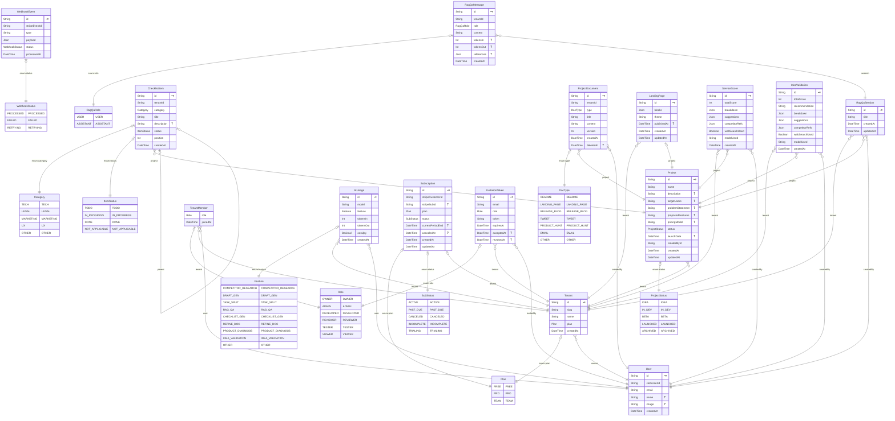

```mermaid
erDiagram

        Plan {
            FREE FREE
PRO PRO
TEAM TEAM
        }
    


        Role {
            OWNER OWNER
ADMIN ADMIN
DEVELOPER DEVELOPER
REVIEWER REVIEWER
TESTER TESTER
VIEWER VIEWER
        }
    


        ProjectStatus {
            IDEA IDEA
IN_DEV IN_DEV
BETA BETA
LAUNCHED LAUNCHED
ARCHIVED ARCHIVED
        }
    


        ItemStatus {
            TODO TODO
IN_PROGRESS IN_PROGRESS
DONE DONE
NOT_APPLICABLE NOT_APPLICABLE
        }
    


        Category {
            TECH TECH
LEGAL LEGAL
MARKETING MARKETING
UX UX
OTHER OTHER
        }
    


        DocType {
            README README
LANDING_PAGE LANDING_PAGE
RELEASE_BLOG RELEASE_BLOG
TWEET TWEET
PRODUCT_HUNT PRODUCT_HUNT
EMAIL EMAIL
OTHER OTHER
        }
    


        Feature {
            COMPETITOR_RESEARCH COMPETITOR_RESEARCH
DRAFT_GEN DRAFT_GEN
TASK_SPLIT TASK_SPLIT
RAG_QA RAG_QA
CHECKLIST_GEN CHECKLIST_GEN
REFINE_DOC REFINE_DOC
PRODUCT_DIAGNOSIS PRODUCT_DIAGNOSIS
IDEA_VALIDATION IDEA_VALIDATION
OTHER OTHER
        }
    


        RagQaRole {
            USER USER
ASSISTANT ASSISTANT
        }
    


        SubStatus {
            ACTIVE ACTIVE
PAST_DUE PAST_DUE
CANCELED CANCELED
INCOMPLETE INCOMPLETE
TRIALING TRIALING
        }
    


        WebhookStatus {
            PROCESSED PROCESSED
FAILED FAILED
RETRYING RETRYING
        }
    
  "User" {
    String id "🗝️"
    String clerkUserId 
    String email 
    String name "❓"
    String image "❓"
    DateTime createdAt 
    }
  

  "Tenant" {
    String id "🗝️"
    String slug 
    String name 
    Plan plan 
    DateTime createdAt 
    }
  

  "TenantMember" {
    Role role 
    DateTime joinedAt 
    }
  

  "Project" {
    String id "🗝️"
    String name 
    String description "❓"
    String targetUsers "❓"
    String problemStatement "❓"
    String proposedFeatures "❓"
    String pricingModel "❓"
    ProjectStatus status 
    DateTime launchDate "❓"
    String createdById 
    DateTime createdAt 
    DateTime updatedAt 
    }
  

  "ChecklistItem" {
    String id "🗝️"
    String tenantId 
    Category category 
    String title 
    String description "❓"
    ItemStatus status 
    Int position 
    DateTime createdAt 
    }
  

  "ProjectDocument" {
    String id "🗝️"
    String tenantId 
    DocType type 
    String title 
    String content 
    Int version 
    DateTime createdAt 
    DateTime deletedAt "❓"
    }
  

  "LandingPage" {
    String id "🗝️"
    Json blocks 
    String theme 
    DateTime publishedAt "❓"
    DateTime createdAt 
    DateTime updatedAt 
    }
  

  "ServiceScore" {
    String id "🗝️"
    Int totalScore 
    Json breakdown 
    Json suggestions 
    Json competitorRefs 
    Boolean webSearchUsed 
    String modelUsed 
    DateTime createdAt 
    }
  

  "IdeaValidation" {
    String id "🗝️"
    Int totalScore 
    String recommendation 
    Json breakdown 
    Json suggestions 
    Json competitorRefs 
    Boolean webSearchUsed 
    String modelUsed 
    DateTime createdAt 
    }
  

  "AIUsage" {
    String id "🗝️"
    String model 
    Feature feature 
    Int tokensIn 
    Int tokensOut 
    Decimal costJpy 
    DateTime createdAt 
    }
  

  "Subscription" {
    String id "🗝️"
    String stripeCustomerId 
    String stripeSubId "❓"
    Plan plan 
    SubStatus status 
    DateTime currentPeriodEnd "❓"
    DateTime canceledAt "❓"
    DateTime createdAt 
    DateTime updatedAt 
    }
  

  "WebhookEvent" {
    String id "🗝️"
    String stripeEventId 
    String type 
    Json payload 
    WebhookStatus status 
    DateTime processedAt 
    }
  

  "RagQaSession" {
    String id "🗝️"
    String title 
    DateTime createdAt 
    DateTime updatedAt 
    }
  

  "RagQaMessage" {
    String id "🗝️"
    String tenantId 
    RagQaRole role 
    String content 
    Int tokensIn "❓"
    Int tokensOut "❓"
    Json references "❓"
    DateTime createdAt 
    }
  

  "InvitationToken" {
    String id "🗝️"
    String email 
    Role role 
    String token 
    DateTime expiresAt 
    DateTime acceptedAt "❓"
    DateTime revokedAt "❓"
    }
  
    "Tenant" |o--|| "Plan" : "enum:plan"
    "Tenant" }o--|| "User" : "owner"
    "TenantMember" |o--|| "Role" : "enum:role"
    "TenantMember" }o--|| "Tenant" : "tenant"
    "TenantMember" }o--|| "User" : "user"
    "Project" |o--|| "ProjectStatus" : "enum:status"
    "Project" }o--|| "Tenant" : "tenant"
    "ChecklistItem" |o--|| "Category" : "enum:category"
    "ChecklistItem" |o--|| "ItemStatus" : "enum:status"
    "ChecklistItem" }o--|| "Project" : "project"
    "ChecklistItem" |o--|o "ChecklistItem" : "parent"
    "ProjectDocument" |o--|| "DocType" : "enum:type"
    "ProjectDocument" }o--|| "Project" : "project"
    "ProjectDocument" }o--|| "User" : "createdBy"
    "LandingPage" }o--|| "Tenant" : "tenant"
    "LandingPage" |o--|| "Project" : "project"
    "ServiceScore" }o--|| "Tenant" : "tenant"
    "ServiceScore" }o--|| "Project" : "project"
    "ServiceScore" }o--|| "User" : "createdBy"
    "IdeaValidation" }o--|| "Tenant" : "tenant"
    "IdeaValidation" }o--|| "Project" : "project"
    "IdeaValidation" }o--|| "User" : "createdBy"
    "AIUsage" |o--|| "Feature" : "enum:feature"
    "AIUsage" }o--|| "Tenant" : "tenant"
    "AIUsage" }o--|| "User" : "user"
    "Subscription" |o--|| "Plan" : "enum:plan"
    "Subscription" |o--|| "SubStatus" : "enum:status"
    "Subscription" |o--|| "Tenant" : "tenant"
    "WebhookEvent" |o--|| "WebhookStatus" : "enum:status"
    "RagQaSession" }o--|| "Tenant" : "tenant"
    "RagQaSession" }o--|| "Project" : "project"
    "RagQaSession" }o--|| "User" : "createdBy"
    "RagQaMessage" |o--|| "RagQaRole" : "enum:role"
    "RagQaMessage" }o--|| "RagQaSession" : "session"
    "InvitationToken" |o--|| "Role" : "enum:role"
    "InvitationToken" }o--|| "Tenant" : "tenant"
    "InvitationToken" }o--|| "User" : "invitedBy"
```
