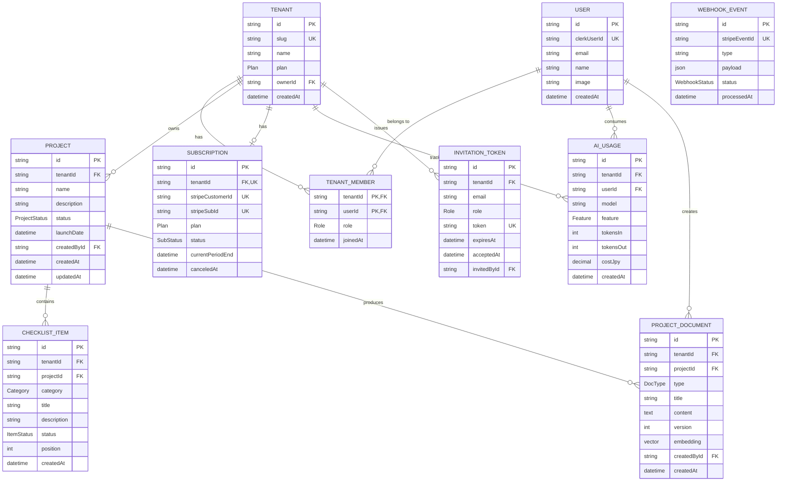

# データモデル設計

## 概要

Shipyard のデータモデルを定義する。マルチテナント前提のため、すべての業務テーブルに `tenantId` カラムを持たせる(ADR-002 参照)。`User` のみテナントに属さない例外。

## ER 図



## Prisma スキーマ

```prisma
// schema.prisma

generator client {
  provider = "prisma-client-js"
  previewFeatures = ["postgresqlExtensions"]
}

datasource db {
  provider   = "postgresql"
  url        = env("DATABASE_URL")
  extensions = [pgvector(map: "vector", schema: "public")]
}

// ============== Enums ==============

/// テナントの課金プラン(ADR-004)
enum Plan {
  /// 無料プラン
  FREE
  /// 個人開発者向け有料プラン
  PRO
  /// 小規模チーム向け
  TEAM
}

/// テナントメンバーの権限ロール(6 種)
enum Role {
  /// オーナー: テナントの全権限。プラン変更・削除・所有権譲渡が可能
  OWNER
  /// 管理者: メンバー招待・削除・ロール変更が可能(プラン変更は不可)
  ADMIN
  /// 開発者: プロジェクト・チェックリスト・ProjectDocument の作成編集が可能
  DEVELOPER
  /// レビュアー: コメント・レビュー操作のみ。本文編集は不可
  REVIEWER
  /// テスター: テスト・バグ報告用の閲覧+コメント権限
  TESTER
  /// 閲覧者: 閲覧のみ。書き込み一切不可
  VIEWER
}

/// プロジェクトのライフサイクル状態
enum ProjectStatus {
  /// アイデア段階(着手前)
  IDEA
  /// 開発中
  IN_DEV
  /// ベータ公開中(限定ユーザーに開放)
  BETA
  /// 一般公開済み
  LAUNCHED
  /// アーカイブ済み(凍結、編集不可)
  ARCHIVED
}

/// チェックリスト項目の状態
enum ItemStatus {
  /// 未着手
  TODO
  /// 着手中
  IN_PROGRESS
  /// 完了
  DONE
  /// 該当なし(プロジェクト特性により不要と判断)
  NOT_APPLICABLE
}

/// チェックリスト項目のカテゴリ
enum Category {
  /// 技術: 実装・テスト・インフラ・セキュリティ
  TECH
  /// 法務: 利用規約・プライバシーポリシー・特商法表記
  LEGAL
  /// マーケティング: SEO・告知文・SNS 投稿・PR
  MARKETING
  /// UX: ユーザビリティ・アクセシビリティ・オンボーディング
  UX
  /// その他
  OTHER
}

/// ProjectDocument の種別(AI 生成・ユーザー手動作成のいずれも対象)
enum DocType {
  /// プロジェクトの README
  README
  /// ランディングページ本文
  LANDING_PAGE
  /// リリースブログ記事
  RELEASE_BLOG
  /// X / Twitter 告知文
  TWEET
  /// Product Hunt 投稿用テキスト
  PRODUCT_HUNT
  /// 告知メール本文
  EMAIL
  /// その他
  OTHER
}

/// AI 利用機能の種別(AIUsage の集計軸、ADR-005)
enum Feature {
  /// 競合調査(Web Search Tool 併用、Sonnet 4)
  COMPETITOR_RESEARCH
  /// ドキュメント自動生成(README / LP / 告知文、Sonnet 4)
  DRAFT_GEN
  /// タスク分解(Tool Use、Haiku 4.5)
  TASK_SPLIT
  /// 過去ドキュメント RAG による QA 応答(Sonnet 4)
  RAG_QA
  /// リリース前チェックリスト生成(Tool Use、Haiku 4.5)
  CHECKLIST_GEN
  /// その他の AI 機能
  OTHER
}

/// Stripe Subscription の状態(Stripe の status をミラー)
enum SubStatus {
  /// 課金中・正常
  ACTIVE
  /// 支払い遅延中(リトライ中)
  PAST_DUE
  /// 解約済み
  CANCELED
  /// 初回支払い未完了
  INCOMPLETE
  /// トライアル期間中
  TRIALING
}

/// Stripe Webhook の処理状態
enum WebhookStatus {
  /// 正常に処理完了
  PROCESSED
  /// 処理失敗(リトライ上限到達)
  FAILED
  /// リトライ中
  RETRYING
}

// ============== Models ==============

/// アプリケーションユーザー。Clerk からミラーされる。
/// 複数のテナントに所属可能(TenantMember 経由)で、テナントには属さない例外モデル。
model User {
  /// 内部 ID(cuid)
  id           String   @id @default(cuid())
  /// Clerk のユーザー ID。Clerk Webhook 受信時の同期キー
  clerkUserId  String   @unique
  /// メールアドレス。連絡用(ログイン認証は Clerk 側で実施)
  email        String   @unique
  /// 表示名(任意、Clerk 側のプロフィール変更で更新)
  name         String?
  /// アバター画像 URL(任意、Clerk から取得)
  image        String?
  /// ユーザー作成日時(Clerk からの初回 Webhook 受信時)
  createdAt    DateTime @default(now())

  memberships  TenantMember[]
  ownedTenants Tenant[]         @relation("TenantOwner")
  documents    ProjectDocument[]
  usage        AIUsage[]
  invitations  InvitationToken[]
}

/// ワークスペース(テナント)。マルチテナント分離の基本単位(ADR-002)。
/// Pool model のため、ほぼ全業務テーブルが tenantId で本モデルを参照する。
model Tenant {
  /// 内部 ID(cuid)
  id          String   @id @default(cuid())
  /// URL 用の人間可読 ID(`/w/{slug}`、ADR-003)。英数字+ハイフン、3〜30 文字
  slug        String   @unique
  /// ワークスペース表示名
  name        String
  /// 現在の課金プラン(Subscription と同期)
  plan        Plan     @default(FREE)
  /// オーナー User ID。プラン変更・削除・所有権譲渡の権限を持つ
  ownerId     String
  /// ワークスペース作成日時
  createdAt   DateTime @default(now())

  owner        User              @relation("TenantOwner", fields: [ownerId], references: [id])
  members      TenantMember[]
  projects     Project[]
  subscription Subscription?
  usage        AIUsage[]
  invitations  InvitationToken[]

  @@index([slug])
}

/// テナントとユーザーの所属関係(多対多の中間テーブル)。
/// ロールはここで管理。Free プランは 3 メンバーまでサーバ側で検証。
model TenantMember {
  /// 所属テナント ID(複合 PK の一部)
  tenantId  String
  /// メンバー User ID(複合 PK の一部)
  userId    String
  /// 権限ロール(6 種、デフォルトは DEVELOPER)
  role      Role     @default(DEVELOPER)
  /// 加入日時(招待受諾日 or オーナー時はテナント作成日)
  joinedAt  DateTime @default(now())

  tenant    Tenant   @relation(fields: [tenantId], references: [id], onDelete: Cascade)
  user      User     @relation(fields: [userId], references: [id], onDelete: Cascade)

  @@id([tenantId, userId])
  @@index([userId])
}

/// プロジェクト(個人開発 1 件 = 1 レコード)。
/// チェックリスト・ProjectDocument の親エンティティ。
model Project {
  /// 内部 ID(cuid)
  id           String        @id @default(cuid())
  /// 所属テナント ID(マルチテナント分離キー、Prisma Client Extension で自動注入)
  tenantId     String
  /// プロジェクト名
  name         String
  /// 概要(Markdown 可、任意)
  description  String?       @db.Text
  /// ライフサイクル状態(IDEA / IN_DEV / BETA / LAUNCHED / ARCHIVED)
  status       ProjectStatus @default(IDEA)
  /// リリース予定日 or 実績日(任意)
  launchDate   DateTime?
  /// 作成者 User ID
  createdById  String
  /// 作成日時
  createdAt    DateTime      @default(now())
  /// 最終更新日時(Prisma 自動更新)
  updatedAt    DateTime      @updatedAt

  tenant       Tenant         @relation(fields: [tenantId], references: [id], onDelete: Cascade)
  checklist    ChecklistItem[]
  documents    ProjectDocument[]

  @@index([tenantId])
  @@index([tenantId, status])
}

/// プロジェクトに紐付くリリース前チェックリスト項目。
/// AI が `CHECKLIST_GEN` 機能で自動生成、ユーザーが手動追加・編集も可能。
model ChecklistItem {
  /// 内部 ID(cuid)
  id           String     @id @default(cuid())
  /// 所属テナント ID(マルチテナント分離キー、必須)
  tenantId     String
  /// 所属プロジェクト ID
  projectId    String
  /// 項目カテゴリ(TECH / LEGAL / MARKETING / UX / OTHER)
  category     Category
  /// 項目タイトル(短文)
  title        String
  /// 詳細説明(Markdown 可、任意)
  description  String?    @db.Text
  /// 進捗状態(TODO / IN_PROGRESS / DONE / NOT_APPLICABLE)
  status       ItemStatus @default(TODO)
  /// 並び順(同一プロジェクト内で昇順表示、手動並び替え対応)
  position     Int        @default(0)
  /// 作成日時
  createdAt    DateTime   @default(now())

  project      Project    @relation(fields: [projectId], references: [id], onDelete: Cascade)

  @@index([tenantId])
  @@index([projectId, position])
}

/// AI が生成 or ユーザーが編集した文書(README / LP / 告知文 等)。
/// embedding は RAG 検索用、同 tenant の過去文書を context に注入する独自性の核(ADR-005)。
model ProjectDocument {
  /// 内部 ID(cuid)
  id           String   @id @default(cuid())
  /// 所属テナント ID(マルチテナント分離キー、必須)
  tenantId     String
  /// 所属プロジェクト ID
  projectId    String
  /// 文書タイプ(README / LANDING_PAGE / RELEASE_BLOG / TWEET 等)
  type         DocType
  /// 文書タイトル
  title        String
  /// Markdown 本文
  content      String   @db.Text
  /// 推敲履歴用バージョン番号(同一 (projectId, type) 内で v1, v2, ... と増加。一意制約あり)
  version      Int      @default(1)
  /// text-embedding-3-small の 1536 次元ベクトル(RAG 検索用、HNSW インデックス)
  embedding    Unsupported("vector(1536)")?
  /// 作成者 User ID
  createdById  String
  /// 作成日時
  createdAt    DateTime @default(now())

  project      Project  @relation(fields: [projectId], references: [id], onDelete: Cascade)
  createdBy    User     @relation(fields: [createdById], references: [id])

  /// 同一プロジェクト・同一タイプ内で version は一意(並行生成時の version 重複を DB レベルで防止)
  @@unique([projectId, type, version])
  @@index([tenantId])
}

/// AI API 呼び出しのテナント単位ログ。
/// プラン別 AI クレジット月次上限判定(Free=0 / Pro=300 / Team=seats×800、ADR-012)と
/// コスト集計に使用(ADR-005)。クレジットはモデル別(Haiku=1 / Sonnet=3 / OTHER=0)。
model AIUsage {
  /// 内部 ID(cuid)
  id         String   @id @default(cuid())
  /// 所属テナント ID(マルチテナント分離キー、必須)
  tenantId   String
  /// 利用者 User ID
  userId     String
  /// 使用モデル ID(例: `claude-sonnet-4-7` / `claude-haiku-4-5-20251001`)
  model      String
  /// 利用機能種別(集計の主軸)
  feature    Feature
  /// 入力トークン数
  tokensIn   Int
  /// 出力トークン数
  tokensOut  Int
  /// 推定コスト(円、為替換算済み、小数 4 桁精度)
  costJpy    Decimal  @db.Decimal(10, 4)
  /// 利用日時
  createdAt  DateTime @default(now())

  tenant     Tenant   @relation(fields: [tenantId], references: [id], onDelete: Cascade)
  user       User     @relation(fields: [userId], references: [id])

  @@index([tenantId, createdAt])
  @@index([tenantId, feature, createdAt])
}

/// Stripe Subscription の DB ミラー(テナント 1:1)。
/// Webhook で更新される。Free プランでも stripeCustomerId は確保(将来の課金切替を高速化)。
model Subscription {
  /// 内部 ID(cuid)
  id                String     @id @default(cuid())
  /// 紐付くテナント ID(1:1 関係、ユニーク制約)
  tenantId          String     @unique
  /// Stripe Customer ID(Free プランでも作成、ユニーク)
  stripeCustomerId  String     @unique
  /// Stripe Subscription ID(Free プラン時は null、ユニーク)
  stripeSubId       String?    @unique
  /// 現在のプラン(Tenant.plan と同期)
  plan              Plan
  /// 課金状態(ACTIVE / PAST_DUE / CANCELED / INCOMPLETE / TRIALING)
  status            SubStatus  @default(ACTIVE)
  /// 現課金期間終了日(次回更新基準、Stripe からの情報)
  currentPeriodEnd  DateTime?
  /// 解約申請日時(7 日 grace → 30 日凍結 → 削除フローの起点、ADR-004)
  canceledAt        DateTime?
  /// レコード作成日時
  createdAt         DateTime   @default(now())
  /// 最終更新日時(Webhook 受信ごとに更新)
  updatedAt         DateTime   @updatedAt

  tenant            Tenant     @relation(fields: [tenantId], references: [id], onDelete: Cascade)
}

/// Stripe Webhook の受信ログ。Idempotency 担保とトラブルシューティングに使用(ADR-004)。
/// テナントを持たない例外モデル(Webhook 受信時点では tenantId 未確定のため)。
model WebhookEvent {
  /// 内部 ID(cuid)
  id              String        @id @default(cuid())
  /// Stripe イベント ID(Idempotency Key、ユニーク制約で重複処理を構造的に防止)
  stripeEventId   String        @unique
  /// イベントタイプ(例: `checkout.session.completed` / `invoice.paid`)
  type            String
  /// 受信ペイロード全体(監査・再処理用)
  payload         Json
  /// 処理状態(PROCESSED / FAILED / RETRYING)
  status          WebhookStatus @default(PROCESSED)
  /// 処理完了日時
  processedAt     DateTime      @default(now())

  @@index([type, processedAt])
}

/// メンバー招待トークン。`/invite/{token}` の URL を生成し、メールで送信。
/// 同一メールへの重複招待は既存トークンを更新する想定。
model InvitationToken {
  /// 内部 ID(cuid)
  id           String   @id @default(cuid())
  /// 招待先テナント ID
  tenantId     String
  /// 招待先メールアドレス
  email        String
  /// 招待時に付与するロール(OWNER 以外を選択可)
  role         Role     @default(DEVELOPER)
  /// 招待リンク用トークン(URL に埋め込む、ユニーク、暗号学的乱数を推奨)
  token        String   @unique
  /// 有効期限(発行から 7 日)
  expiresAt    DateTime
  /// 受諾日時(null = 未受諾)
  acceptedAt   DateTime?
  /// 招待者 User ID
  invitedById  String

  tenant       Tenant   @relation(fields: [tenantId], references: [id], onDelete: Cascade)
  invitedBy    User     @relation(fields: [invitedById], references: [id])

  @@index([tenantId, email])
  @@index([token])
}
```

## インデックス戦略

### 基本方針

- すべての業務テーブルで `@@index([tenantId])` を必ず付与(マルチテナントクエリの効率化)
- 頻出検索パターンには複合インデックスを追加

### 主要なインデックス

| テーブル        | インデックス                      | 用途                                      |
| --------------- | --------------------------------- | ----------------------------------------- |
| Tenant          | slug                              | サブパス `/w/{slug}` からの解決           |
| TenantMember    | (tenantId, userId) PK             | テナント所属チェック                      |
| TenantMember    | userId                            | ユーザーの所属テナント一覧                |
| Project         | (tenantId, status)                | ダッシュボードでのステータス絞り込み      |
| ChecklistItem   | (projectId, position)             | チェックリストの順序保証付き取得          |
| ProjectDocument | (projectId, type, version) UNIQUE | 文書タイプ別最新版取得 + version 重複防止 |
| AIUsage         | (tenantId, createdAt)             | 月次集計の高速化                          |
| AIUsage         | (tenantId, feature, createdAt)    | 機能別の使用量分析                        |

### pgvector インデックス

`ProjectDocument.embedding` には HNSW インデックスを別途 SQL マイグレーションで追加:

```sql
CREATE INDEX ON "ProjectDocument" USING hnsw (embedding vector_cosine_ops);
```

cosine 類似度を採用(text-embedding-3-small が L2 正規化済みのため)。

## マルチテナント整合性の担保

### Prisma Client Extension での自動 tenantId 注入

Service 層で `tenantId` を意識せず書ける仕組みを Day 5 で実装する。詳細は ADR-002 と前回のコード例を参照。

対象テーブル:

- Project, ChecklistItem, ProjectDocument, AIUsage, InvitationToken
- 対象外(テナントを持たない): User, WebhookEvent
- 別扱い(1対1): TenantMember, Subscription

### Raw SQL 利用時の規約

- 原則禁止
- やむを得ず使う場合は `WHERE tenantId = $1` を明示
- ESLint カスタムルール `no-raw-sql-without-tenant-filter` で検出する

## マイグレーション順序(Day 5 で実施)

1. PostgreSQL に pgvector 拡張をインストール
2. Enum 群を作成
3. User → Tenant → TenantMember(独立性の高いものから)
4. Project → ChecklistItem → ProjectDocument
5. AIUsage → Subscription → WebhookEvent → InvitationToken
6. インデックス作成(HNSW を含む)

## 開発時のシードデータ

最小限のシードデータをローカル開発用に用意する:

- ユーザー2人(自分 + テスト用ダミー)
- テナント2つ(個人ワークスペース + テスト用組織)
- プロジェクト3つ(IDEA / IN_DEV / LAUNCHED の各ステータス)
- チェックリスト項目10個(各カテゴリから2〜3個)
- ProjectDocument 2 件(README v1 + LP v1)

## フォローアップ

- ユーザー削除時のデータ保持(GDPR 対応)を別途設計
- バックアップ・リストア戦略の文書化
- レプリカへの読み取り分散(将来)
