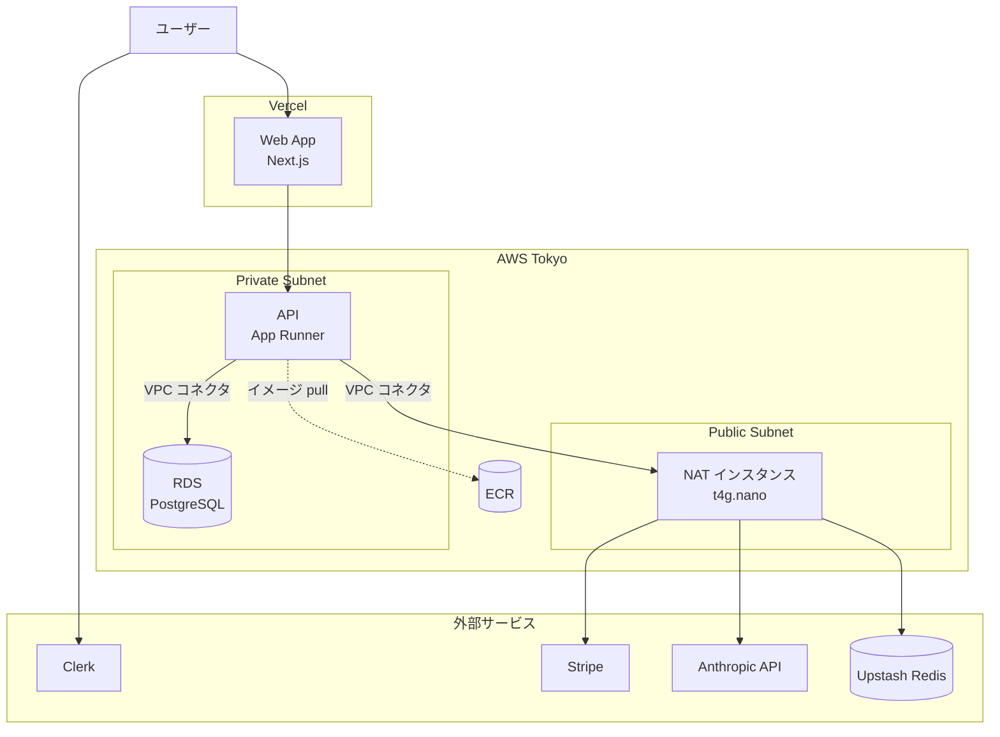

# インフラ構成と運用コスト

## このドキュメントについて

Shipyard の現状のインフラスタックと、システム運用にかかる費用の概算をまとめます。

- 構成の決定経緯:[ADR-010](adr/010-iac-tool.md)(IaC ツール = Terraform)、[ADR-011](adr/011-lightweight-aws-architecture.md)(軽量 AWS 構成)
- 本番デプロイの詳細図:`architecture.md`(※軽量 AWS への追従更新は Day 36 予定)
- **コスト数値は 2026-05 時点・東京リージョン(`ap-northeast-1`)の概算**です。AWS / 各 SaaS の料金改定で変動します。為替は ¥150/$ で換算しています。

---

## 1. インフラスタック

Shipyard は「軽量 AWS 構成」(ADR-011)を採用しています。Web は Vercel、API は AWS、DB は AWS、Redis は外部 SaaS という分散構成です。

| レイヤ             | 技術                  | ホスティング                            | 役割                                           |
| ------------------ | --------------------- | --------------------------------------- | ---------------------------------------------- |
| Web フロント       | Next.js               | **Vercel**                              | UI・LP・公開ページ                             |
| API                | NestJS                | **AWS App Runner**                      | ビジネスロジック・Webhook 処理                 |
| Worker             | BullMQ / NestJS       | App Runner(API と同一イメージ)          | AI 非同期処理                                  |
| DB                 | PostgreSQL + pgvector | **AWS RDS**(`db.t4g.micro`)             | リレーショナル + ベクトル検索                  |
| Redis              | —                     | **Upstash**(serverless Redis)           | ジョブキュー・キャッシュ                       |
| コンテナレジストリ | —                     | **AWS ECR**                             | API イメージの保管                             |
| ネットワーク       | —                     | **AWS VPC** / Subnet / NAT インスタンス | API ↔ DB ↔ 外部 API の経路                     |
| IaC                | —                     | **Terraform**(state は AWS S3)          | インフラのコード管理                           |
| 認証               | —                     | Clerk                                   | サインイン・組織管理                           |
| 課金               | —                     | Stripe                                  | サブスクリプション決済                         |
| AI(生成)           | —                     | Anthropic API                           | LLM(Sonnet 4 / Haiku 4.5)                      |
| AI(埋め込み)       | —                     | OpenAI API                              | RAG 用ベクトル埋め込み(text-embedding-3-small) |
| メール             | —                     | Resend                                  | 招待メール等                                   |
| ドメイン / 証明書  | —                     | AWS Route53 / ACM                       | 独自ドメイン・TLS                              |

### ネットワーク構成



App Runner は VPC コネクタ経由で Private Subnet の RDS に接続します。VPC コネクタを使うと App Runner の外向き通信が全量 VPC 経由になるため、外部 API(Anthropic / Stripe / Upstash)へ出るために NAT インスタンスを経由します。

---

## 2. 運用コスト

### 2.1 課金の 3 タイプ

AWS / SaaS の課金はリソースによって性質が異なります。

| タイプ                   | 意味                                           | 該当例                                                        |
| ------------------------ | ---------------------------------------------- | ------------------------------------------------------------- |
| **無料**                 | 存在しても $0                                  | VPC / Subnet / IGW / Security Group / IAM / ACM 証明書        |
| **プロビジョニング課金** | 存在する限り時間課金(使わなくてもかかる)       | RDS / NAT インスタンス / App Runner の確保メモリ / Route53    |
| **従量課金**             | 使った分だけ(リクエスト・データ量・ストレージ) | App Runner の実行 CPU / Upstash / ECR ストレージ / データ転送 |

### 2.2 フェーズで分けて考える

- **公開前(現在 〜 Week 6)**:常時稼働するインフラは不要です。開発はローカル(`docker-compose`)で行い、AWS は検証時だけ `terraform apply` → 確認 → **`terraform destroy`**。**運用コストはほぼ $0** に保てます。
- **公開後**:顧客にサービスを出し続けるため DB・API が 24 時間稼働します。これがユーザー数ゼロでも毎月かかる**フロア(固定費)**です。

### 2.3 コンポーネント別 月額概算

| サービス                    | 課金タイプ              | 公開前         | 公開後フロア(概算/月)             |
| --------------------------- | ----------------------- | -------------- | --------------------------------- |
| Vercel(Web)                 | プラン固定              | $0(Hobby)      | **$20**(Pro。商用は Pro が必要)   |
| App Runner(API)             | プロビジョニング + 従量 | $0(未デプロイ) | **$12〜20**                       |
| RDS `db.t4g.micro`          | プロビジョニング        | $0(未作成)     | **$15**(本体 + ストレージ)        |
| NAT インスタンス `t4g.nano` | プロビジョニング        | $0             | **$7〜9**(本体 + IPv4 + EBS)      |
| Upstash Redis               | 従量(無料枠あり)        | $0             | **$0〜10**(低トラフィックなら $0) |
| Route53                     | 固定                    | $0             | **$0.5**                          |
| ECR / S3(state)             | 従量(ストレージ)        | ~$0            | **~$0**                           |
| ACM 証明書                  | 無料                    | $0             | $0                                |
| CloudWatch / データ転送     | 従量                    | $0             | **$1〜5**                         |
| **合計**                    |                         | **~$0**        | **概算 月 $55〜80**               |

> Vercel を Hobby のまま運用する場合は -$20 ですが、Hobby プランは非商用向けの規約のため、収益化する SaaS は Pro が必要です。

### 2.4 外部サービス・AI API のコスト(従量)

上記のフロアには **AI API(Claude / OpenAI)や外部 SaaS の利用料は含まれません**。これらは利用量に応じた**従量課金**で、利用がゼロならコストもゼロです。性質としてはインフラの固定費ではなく「売上原価」に近く、プラン価格に織り込むべきものです。

| サービス                       | 用途                          | 課金                                                                      |
| ------------------------------ | ----------------------------- | ------------------------------------------------------------------------- |
| Anthropic Claude               | AI 生成・壁打ち・ドラフト生成 | API 従量。Sonnet 4 は高品質・高単価、Haiku 4.5 は安価。ADR-005 で使い分け |
| OpenAI(text-embedding-3-small) | RAG のベクトル埋め込み        | API 従量。100 万トークン $0.02 程度と非常に安価                           |
| Clerk                          | 認証                          | 無料枠 → MAU 超過分が従量                                                 |
| Stripe                         | 決済                          | 決済額に対する手数料(売上から差引)                                        |
| Resend                         | メール送信                    | 無料枠 → 超過分が従量                                                     |

AI 利用料は `AIUsage` テーブルで記録・追跡します(ADR-005)。MVP 規模(少数ユーザー)では月数ドル程度で、利用量に比例して増えます。埋め込みは安価で、生成コストは Sonnet / Haiku の使い分けで最適化します。

#### embedding コストの扱い(ADR-012 のクレジット制と本損益試算の関係)

ADR-012 の AI クレジット制は **embedding(`text-embedding-3-small`、`Feature.OTHER`)を 0 cr** として扱います(ユーザーの「検索体験」を阻害しないため + 実コストが桁違いに小さいため)。一方、本ドキュメントの損益試算(§2.5)に挙げる Pro 満額 ¥900 / Team 満額 ¥2,400 などの数字は **Anthropic の generation コストのみ**で算出しており、OpenAI の embedding コストは明示的には含めていません。

理由:embedding コストが generation コストに対して**桁違いに小さい**ためです。

| 観点             | embedding(text-embedding-3-small)                  | generation(Sonnet 4) | 比              |
| ---------------- | -------------------------------------------------- | -------------------- | --------------- |
| 1 回あたり概算   | 〜¥0.0008(クエリ 100 トークン想定)                 | 〜¥9                 | **約 1/10,000** |
| Pro 満額(月)     | 〜¥0.5(クエリ 100 回 + ドキュメント保存 50 件想定) | ¥900                 | **約 0.05%**    |
| 損益試算への影響 | 無視できる(粗利率 33% → 32.95% 程度)               | 主要因               | —               |

→ 本ドキュメントの損益試算は **embedding を含めても結論が変わらない** ため、簡潔さを優先して generation コストのみで記述しています。

ただし、理論上の抜け穴として **ドキュメント大量保存による embedding コスト膨張** はあり得ます(`Feature.OTHER` なので credits 消費はゼロ)。実例として:

- 月 100 ドキュメント保存 → 〜¥1
- 月 10,000 ドキュメント保存 → 〜¥100
- 月 100,000 ドキュメント保存(非現実的)→ 〜¥1,000

通常の人間の運用では発生しない規模で、v2 で per-tenant のドキュメント数上限を設けるかは要観察。MVP では運用監視(DB / UI 上で異常検知)で対応。

### 2.5 損益分岐

```
必要な課金ユーザー数 = 毎月のフロア ÷ 1 ユーザー単価
```

フロアを月 $65(≒ ¥9,750)、Team プランを ¥2,800/人とすると:

**¥9,750 ÷ ¥2,800 ≒ 4 人**

→ **約 4 人の課金ユーザー**でインフラ運用費を回収できます。当初の重量 AWS 構成(フロア月 ~$100〜130、約 6 人)より黒字化のハードルが下がっています。

### 2.6 新規 AWS アカウントの初期クレジット

2025 年以降に作成する新規 AWS アカウントは、クレジット制の無料利用枠(概ね $100〜200、有効期限あり)が付与されます。AWS 部分のフロア(月 ~$35〜45)はこのクレジットで**当面の数ヶ月は実質無料**で運用できます。

- クレジットには**有効期限**があり、切れると課金が始まります。
- 正確な額・条件は作成時期で変わるため、アカウント作成画面で必ず確認してください。

---

## 3. コスト最適化の運用ルール

- **公開まで `terraform destroy` 運用**を徹底する。開発はローカルで行い、AWS は検証時だけ立てて畳む。
- **AWS Budgets で予算アラートを設定**する(月予算 + 50 / 80 / 100% でメール通知)。クレジット枯渇後の課金事故を防ぐ最重要設定。Day 39 で実施。
- **AWS Cost Anomaly Detection**(無料)を有効化する。
- 課金リソース(RDS / NAT / App Runner)を畳めば課金は止まる。無料リソース(VPC / Subnet 等)は残しても害がない。
- トラフィックが増えるまで RDS は Single-AZ、NAT は単一インスタンスで運用する。

---

## 4. 前提・注意

- 本ドキュメントの金額はすべて概算です。実際の請求は AWS / 各 SaaS の最新料金とリージョン・利用量で変動します。
- `terraform plan` / `apply` は AWS 認証情報が必要で、現時点では未実施です。実際のコストは初回 apply 後に AWS コンソールの請求ダッシュボードで確認してください。
- 規模拡大時(トラフィック増)は、NAT インスタンス → NAT Gateway、RDS Single-AZ → Multi-AZ、App Runner → ECS への移行を再評価します(ADR-011 フォローアップ)。
