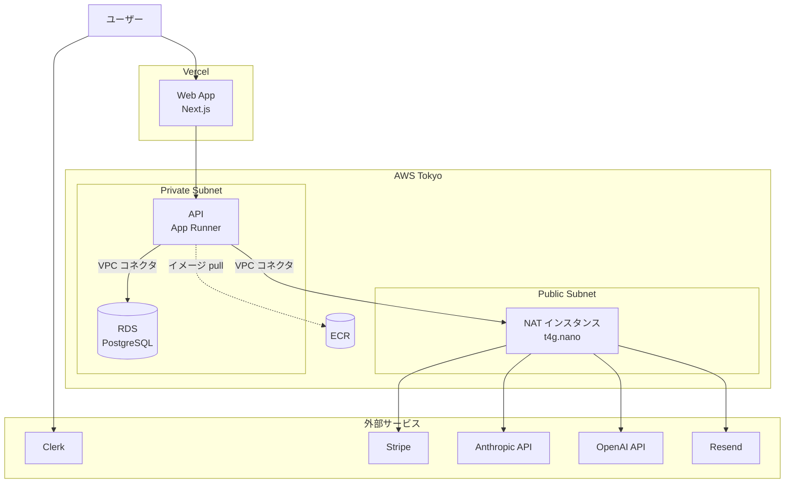

# インフラ構成と運用コスト

## このドキュメントについて

Shipyard の現状のインフラスタックと、システム運用にかかる費用の概算をまとめます。

- 構成の決定経緯:[ADR-010](adr/010-iac-tool.md)(IaC ツール = Terraform)、[ADR-011](adr/011-lightweight-aws-architecture.md)(軽量 AWS 構成)
- 本番デプロイの詳細図:[`architecture.md`](architecture.md)(2026-07-25 に軽量 AWS 構成へ追従更新済み)
- 構築手順:[`runbooks/production-cutover.md`](runbooks/production-cutover.md)
- **コスト数値は 2026-07 時点・東京リージョン(`ap-northeast-1`)の概算**です。AWS / 各 SaaS の料金改定で変動します。為替は ¥150/$ で換算しています。
- **2026-07-25 に `infra/prod/*.tf` の実リソースと突き合わせて再整理しました**(Secrets Manager / VPC Flow Logs / CloudWatch アラームの追記、RDS の東京リージョン価格への補正、Upstash の実態反映、損益分岐の粗利ベース化、削減レバーの追加、Vercel の Pro 移行方針、**初期クレジットの適用範囲と収益ゼロ期の実費**)。数値の確定前に AWS Pricing Calculator で検証してください。
- **「初期クレジットがあるうちは運用費ゼロ」ではありません。** クレジットが打ち消すのは AWS の請求だけで、AI 原価(Anthropic / OpenAI)とドメイン代は初月から実費です。詳細は **§2.7** を参照してください。

---

## 1. インフラスタック

Shipyard は「軽量 AWS 構成」(ADR-011)を採用しています。Web は Vercel、API は AWS、DB は AWS、Redis は外部 SaaS という分散構成です。

| レイヤ             | 技術                  | ホスティング                            | 役割                                           |
| ------------------ | --------------------- | --------------------------------------- | ---------------------------------------------- |
| Web フロント       | Next.js               | **Vercel**                              | UI・LP・公開ページ                             |
| API                | NestJS                | **AWS App Runner**                      | ビジネスロジック・Webhook 処理                 |
| Worker             | BullMQ / NestJS       | App Runner(API と同一イメージ)          | AI 非同期処理(**MVP 未実装 / v1.x**)           |
| DB                 | PostgreSQL + pgvector | **AWS RDS**(`db.t4g.micro`)             | リレーショナル + ベクトル検索                  |
| Redis              | —                     | **Upstash**(serverless Redis)           | ジョブキュー・キャッシュ(**MVP 未実装 / v1.x**)|
| コンテナレジストリ | —                     | **AWS ECR**                             | API イメージの保管                             |
| ネットワーク       | —                     | **AWS VPC** / Subnet / NAT インスタンス | API ↔ DB ↔ 外部 API の経路                     |
| IaC                | —                     | **Terraform**(state は AWS S3)          | インフラのコード管理                           |
| 認証               | —                     | Clerk                                   | サインイン・組織管理                           |
| 課金               | —                     | Stripe                                  | サブスクリプション決済                         |
| AI(生成)           | —                     | Anthropic API                           | LLM(Sonnet 4 / Haiku 4.5)                      |
| AI(埋め込み)       | —                     | OpenAI API                              | RAG 用ベクトル埋め込み(text-embedding-3-small) |
| メール             | —                     | Resend                                  | 招待メール等                                   |
| ドメイン / 証明書  | —                     | AWS Route53 / ACM                       | 独自ドメイン・TLS                              |

### ネットワーク構成


```mermaid
flowchart TB
    User[ユーザー]

    subgraph Vercel
        Web[Web App<br/>Next.js]
    end

    subgraph AWS["AWS Tokyo"]
        subgraph Public["Public Subnet"]
            NAT[NAT インスタンス<br/>t4g.nano]
        end
        subgraph Private["Private Subnet"]
            API[API<br/>App Runner]
            RDS[(RDS<br/>PostgreSQL)]
        end
        ECR[(ECR)]
    end

    subgraph External["外部サービス"]
        Clerk[Clerk]
        Stripe[Stripe]
        Anthropic[Anthropic API]
        OpenAI[OpenAI API]
        Resend[Resend]
    end

    User --> Web
    User --> Clerk
    Web --> API
    API -->|VPC コネクタ| RDS
    API -->|VPC コネクタ| NAT
    NAT --> Anthropic
    NAT --> OpenAI
    NAT --> Stripe
    NAT --> Resend
    API -.イメージ pull.-> ECR
```

App Runner は VPC コネクタ経由で Private Subnet の RDS に接続します。VPC コネクタを使うと App Runner の外向き通信が全量 VPC 経由になるため、外部 API(Anthropic / OpenAI / Stripe / Clerk / Resend)へ出るために NAT インスタンスを経由します。**この「RDS に繋ぐために VPC egress → 外部 API に出るために NAT が必須」という連鎖が、NAT インスタンス代($7.5/月)が避けられない理由**です(§3.2 参照)。

> **Upstash Redis は MVP では未使用**です。`apps/api` に Redis / BullMQ の実装・依存・環境変数はいずれも存在せず(告知配信も同期即時実行)、契約自体が不要です。ADR-011 の構成図には将来の非同期処理用として載っていますが、コスト計上は v1.x からになります。

---

## 2. 運用コスト

### 2.1 課金の 3 タイプ

AWS / SaaS の課金はリソースによって性質が異なります。

| タイプ                   | 意味                                           | 該当例                                                        |
| ------------------------ | ---------------------------------------------- | ------------------------------------------------------------- |
| **無料**                 | 存在しても $0                                  | VPC / Subnet / IGW / Security Group / IAM / ACM 証明書        |
| **プロビジョニング課金** | 存在する限り時間課金(使わなくてもかかる)       | RDS / NAT インスタンス / App Runner の確保メモリ / Route53    |
| **従量課金**             | 使った分だけ(リクエスト・データ量・ストレージ) | App Runner の実行 CPU / VPC Flow Logs / ECR ストレージ / データ転送 |

### 2.2 フェーズで分けて考える

- **公開前(現在 〜 Week 6)**:常時稼働するインフラは不要です。開発はローカル(`docker-compose`)で行い、AWS は検証時だけ `terraform apply` → 確認 → **`terraform destroy`**。**運用コストはほぼ $0** に保てます。
- **公開後**:顧客にサービスを出し続けるため DB・API が 24 時間稼働します。これがユーザー数ゼロでも毎月かかる**フロア(固定費)**です。

### 2.3 課金が始まるタイミング(段階別)

`terraform apply` は一度に全部やる必要がありません。「いつ何を作ると、いくら走り始めるか」を段階で分けると、公開前の空回し費用を抑えられます。

| 段階 | 作るもの                                                                   | 追加/月      | 累計/月  |
| ---- | -------------------------------------------------------------------------- | ------------ | -------- |
| ①    | ドメイン取得 + `infra/bootstrap` apply(state 用 S3)                        | **~$1.5**    | ~$1.5    |
| ②    | `infra/prod` apply(`enable_apprunner_service = false`)= VPC / SG / IAM / ECR / Route53 / Secrets / 監視 / **RDS** / **NAT** | **+$30 前後** | ~$32     |
| ③    | App Runner 有効化(ECR に push 後、`enable_apprunner_service = true`)        | **+$11〜14** | ~$45     |
| ④    | 公開(**Vercel は Hobby のまま**、§3.2 C の判断)                            | **+$0**      | **~$45** |
| ⑤    | 初回課金の成立 → Vercel を Pro へ                                          | **+$20**     | **~$65** |

**②で月 $30 前後が走り始めます。** 受入検証と並行して本番構築を進める場合、検証にあと 2 週間かかるなら追加出費は約 $15 で、新規 AWS アカウントの初期クレジット(§2.6)で吸収できる範囲です。

段階を遅らせるより効果的な選択肢:

- **App Runner の一時停止**:検証していない間ポーズすればプロビジョニングメモリ課金($10/月相当)が止まる。③を先に作っても実質②のコストに戻せる
- **Route53 ホストゾーンだけ先行**:Clerk / Resend のドメイン検証に必要なのはゾーンだけなので、`terraform apply -target` でゾーンを先に作れば②を遅らせられる(ただし部分適用は state 管理が煩雑なため、素直に全 apply → 検証後 `destroy` のほうが安全)

### 2.4 コンポーネント別 月額概算(公開後フロア)

`infra/prod/*.tf` の実リソースに対応させた内訳です。

| サービス                    | 課金タイプ              | 公開前         | 公開後フロア(概算/月)                                                        |
| --------------------------- | ----------------------- | -------------- | ---------------------------------------------------------------------------- |
| RDS `db.t4g.micro`          | プロビジョニング        | $0(未作成)     | **$21〜24**(本体 $19〜21 + gp3 20GB $2.3。Single-AZ、バックアップ 7 日は DB サイズ以内なら無料) |
| App Runner(API)             | プロビジョニング + 従量 | $0(未デプロイ) | **$11〜14**(確保メモリ 2GB $10.2 が**アイドルでも常時**+ アクティブ CPU)     |
| NAT インスタンス `t4g.nano` | プロビジョニング        | $0             | **$7.5**(本体 $3.1 + EBS $0.7 + **Elastic IP $3.7**)                        |
| VPC Flow Logs               | 従量                    | $0             | **$1〜4**(削減前 = `traffic_type = ALL` 想定。**現在は `REJECT` に変更済で実質 $0.2 前後**、14 日保持) |
| Route53                     | 固定 + 従量             | $0             | **$0.5〜1**(ホストゾーン $0.5 + クエリ)                                     |
| Secrets Manager             | 固定 + 従量             | $0             | **$0.4**(シークレット 1 本。App Runner は起動時のみ取得)                     |
| CloudWatch アラーム(3 個)   | 固定                    | $0             | **$0.3**(無料枠が効けば $0)                                                 |
| ECR / S3(state) / データ転送 | 従量                    | ~$0            | **$0〜2**(未タグイメージは 14 日で自動削除)                                 |
| VPC / Subnet / IGW / SG / IAM / SNS / VPC コネクタ / ACM | 無料 | $0 | **$0**                                                                       |
| **AWS 小計**                |                         | **~$0**        | **$42〜48**(≒ 月 ¥6,300〜7,200)                                            |
| Vercel(Web)                 | プラン固定              | $0(Hobby)      | **$0 →(収益化後)$20**(§3.2 C の判断で公開時は Hobby 継続)                 |
| ドメイン                    | 年額                    | —              | **~$1.5**(`.app` で年 $14〜20 想定。人気文字列はプレミアム価格)             |
| Upstash Redis               | 従量(無料枠あり)        | $0             | **$0**(MVP 未使用、v1.x で BullMQ 導入時に発生)                             |
| **合計(公開直後〜収益化まで)** |                      | **~$0**        | **概算 月 $44〜50**(≒ ¥6,600〜7,500)                                       |
| **合計(Vercel Pro 移行後)** |                         | —              | **概算 月 $64〜70**(≒ ¥9,600〜10,500)                                      |

**費用の重心は RDS(約 1/3)と App Runner + NAT(約 1/3)**です。削減を検討する場合はこの 3 つが対象になります(§3.2)。

> 上表は**削減前**の値です。**2026-07-25 に §3.2 A の 2 件を `infra/prod/` の既定値へ反映済み**(App Runner を 0.5 vCPU / 1 GB、VPC Flow Logs を `REJECT`)のため、この構成で apply した場合の実際の AWS 小計は **$36〜40** になります(§3.3 の「A 適用後」列)。

### 2.5 外部サービス・AI API のコスト(従量)

上記のフロアには **AI API(Claude / OpenAI)や外部 SaaS の利用料は含まれません**。これらは利用量に応じた**従量課金**で、利用がゼロならコストもゼロです。性質としてはインフラの固定費ではなく「売上原価」に近く、プラン価格に織り込むべきものです。

| サービス                       | 用途                          | 課金                                                                      |
| ------------------------------ | ----------------------------- | ------------------------------------------------------------------------- |
| Anthropic Claude               | AI 生成・壁打ち・ドラフト生成 | API 従量。Sonnet 4 は高品質・高単価、Haiku 4.5 は安価。ADR-005 で使い分け |
| OpenAI(text-embedding-3-small) | RAG のベクトル埋め込み        | API 従量。100 万トークン $0.02 程度と非常に安価                           |
| Clerk                          | 認証                          | 無料枠 → MAU 超過分が従量                                                 |
| Stripe                         | 決済                          | 決済額に対する手数料(売上から差引)                                        |
| Resend                         | メール送信                    | 無料枠 → 超過分が従量                                                     |

AI 利用料は `AIUsage` テーブルで記録・追跡します(ADR-005)。MVP 規模(少数ユーザー)では月数ドル程度で、利用量に比例して増えます。埋め込みは安価で、生成コストは Sonnet / Haiku の使い分けで最適化します。

#### embedding コストの扱い(ADR-012 のクレジット制と本損益試算の関係)

ADR-012 の AI クレジット制は **embedding(`text-embedding-3-small`、`Feature.OTHER`)を 0 cr** として扱います(ユーザーの「検索体験」を阻害しないため + 実コストが桁違いに小さいため)。一方、本ドキュメントの損益試算(§2.6)に挙げる Pro 満額 ¥900 / Team 満額 ¥2,400 などの数字は **Anthropic の generation コストのみ**で算出しており、OpenAI の embedding コストは明示的には含めていません。

理由:embedding コストが generation コストに対して**桁違いに小さい**ためです。

| 観点             | embedding(text-embedding-3-small)                  | generation(Sonnet 4) | 比              |
| ---------------- | -------------------------------------------------- | -------------------- | --------------- |
| 1 回あたり概算   | 〜¥0.0008(クエリ 100 トークン想定)                 | 〜¥9                 | **約 1/10,000** |
| Pro 満額(月)     | 〜¥0.5(クエリ 100 回 + ドキュメント保存 50 件想定) | ¥900                 | **約 0.05%**    |
| 損益試算への影響 | 無視できる(粗利率 33% → 32.95% 程度)               | 主要因               | —               |

→ 本ドキュメントの損益試算は **embedding を含めても結論が変わらない** ため、簡潔さを優先して generation コストのみで記述しています。

ただし、理論上の抜け穴として **ドキュメント大量保存による embedding コスト膨張** はあり得ます(`Feature.OTHER` なので credits 消費はゼロ)。実例として:

- 月 100 ドキュメント保存 → 〜¥1
- 月 10,000 ドキュメント保存 → 〜¥100
- 月 100,000 ドキュメント保存(非現実的)→ 〜¥1,000

通常の人間の運用では発生しない規模で、v2 で per-tenant のドキュメント数上限を設けるかは要観察。MVP では運用監視(DB / UI 上で異常検知)で対応。

### 2.6 損益分岐

```
必要な課金ユーザー数 = 毎月のフロア ÷ 1 ユーザーあたりの粗利
```

分母を「売上」ではなく **「粗利(売上 − AI 原価)」** に取るのが正確です。AI 原価は §2.5 のとおり売上原価に相当し、フロアとは別に発生するためです。フロアを月 $65(≒ ¥9,750)とすると:

> 課金ユーザーが 1 人でもいる時点で Vercel は Pro(§3.2 C の方針)なので、損益分岐の計算には Pro 込みの $65 を使います。収益ゼロ期のフロア($44〜50)はクレジットで賄う前提で、分岐点の議論には含めません。

| プラン       | 売上/人 | AI 原価(満額消費時) | 粗利/人 | 必要人数     |
| ------------ | ------- | -------------------- | ------- | ------------ |
| Team         | ¥2,800  | ¥2,400               | ¥400    | **約 25 人** |
| Pro          | ¥1,480  | ¥900                 | ¥580    | **約 17 人** |
| (AI 原価を無視した参考値) | — | — | —      | 4〜7 人      |

**「約 4 人で黒字」は AI 原価をゼロとみなした最良ケース**です。実際には全ユーザーがクレジットを使い切ることはないため実効はこの中間になりますが、**損益を支配するのはユーザー数ではなく平均クレジット消費率**という理解が正確です。

→ ADR-012 の KPI(トライアル → Pro 転換率 ≥ 10%)に加えて、**平均クレジット消費率を公開初月から計測**すべきです(`AIUsage` テーブルから算出可能)。消費率が想定より高ければ、値上げ・クレジット上限の見直し・Haiku 比率を上げるプロンプト最適化のいずれかが必要になります。

### 2.7 新規 AWS アカウントの初期クレジット

2025 年以降に作成する新規 AWS アカウントは、クレジット制の無料利用枠(概ね $100〜200、有効期限あり)が付与されます。**A の削減(§3.2)を適用し Vercel Hobby で運用する場合の AWS フロアは月 $36〜40** なので、クレジットで **2〜5 ヶ月は AWS の請求を実質ゼロ**にできます。

- クレジットには**有効期限**があり、切れた月にフロアが丸ごと立ち上がります。
- 正確な額・条件は作成時期で変わるため、アカウント作成画面で必ず確認してください。**「$100〜200」は一般的な水準であり、保証された金額ではありません。**
- **クレジットの適用対象外**になるものがあります。特に **Route53 のドメイン登録料**は一般にクレジットの対象外です。

#### ⚠ 「クレジットがあるうちは運用費ゼロ」ではありません

**クレジットが打ち消すのは AWS の請求だけ**です。以下は初月から実費として出ていきます。

| 費目                    | 金額の目安                        | クレジット | 備考                                                                                             |
| ----------------------- | --------------------------------- | ---------- | ------------------------------------------------------------------------------------------------ |
| AWS 一式                | 月 $36〜40                        | **対象**   | クレジット期間中は実質 $0                                                                        |
| ドメイン                | 年 ¥2,000〜3,000(初月に前払い)    | **対象外** | Route53 のドメイン登録料は一般にクレジット適用外                                                 |
| **Anthropic / OpenAI**  | **利用量に比例(下記)**            | **対象外** | **完全な実費。収益ゼロ期の主要な持ち出し**                                                       |
| Vercel(Hobby)/ Clerk / Resend | $0                          | —          | いずれも無料枠内(§2.4)                                                                          |
| Stripe                  | 売上の 3.6%                       | —          | 売上から差し引かれるため持ち出しなし                                                             |

**AI 原価は 3 つの局面で発生します。**

1. **公開前(受入検証中)**:AI 機能 8 種の打鍵分。特に**プロダクト診断 / アイデア検証は Sonnet の 2-step + Web Search Tool**(Anthropic 側で検索回数も従量課金)で 1 回 6 cr 相当と重い
2. **公開準備**:デモ動画・スクリーンショット撮影、本番疎通確認での実行分
3. **公開後**:**トライアルユーザーの AI 消費は全額こちらの持ち出し**。7 日 Pro トライアルはクレカ登録不要(`trial_settings.missing_payment_method: 'cancel'`)のため、使われた分は回収できない原価になる

ADR-012 のユニットエコノミクス試算もこれを織り込んでおり、**MVP 直後(月アクティブ 50)は純利益 -¥7,416/月**(うちトライアル負担 -¥2,250)と見積もっています。

> **正しい理解は「運用費ゼロ」ではなく「赤字をクレジットで相殺している」**です。クレジットは AWS の請求を消すだけで、事業としては AI 原価分の持ち出しが続きます。

#### 収益ゼロ期に実際に財布から出る額(概算)

| 時期                           | 実費の目安                                                    |
| ------------------------------ | ------------------------------------------------------------- |
| 公開まで(受入検証中)           | ドメイン ¥2,000〜3,000 + AI 実費(数百〜数千円)                |
| 公開後〜クレジット期間中       | **月 ¥2,000〜3,000 程度**(AI 原価・トライアル負担が中心)      |
| **クレジット切れ後**           | 上記 + **月 $38〜65(¥5,700〜9,800)が一気に立ち上がる**        |

#### クレジット切れへの備え(最重要)

請求ゼロに慣れた状態から急にフロアが立ち上がるため、**クレジット切れの月が最大の事故ポイント**です。

- [ ] アカウント作成時に**クレジットの実額と有効期限を控え、カレンダーに期限日を登録**する(AWS Billing コンソール → Credits で残高・期限を確認)
- [ ] **AWS Budgets の閾値を実フロアに合わせる**(下記注記)
- [ ] クレジット残高を月次で確認する(Cost Explorer でクレジット適用前の「本来の請求額」を見る習慣をつける)

> **`monthly_budget_usd` の既定値(50)は実フロアと整合していません。** §2.4 の AWS 小計は $42〜48(A 適用後は $36〜40)で、そのままだと 80% / 100% 閾値のアラートが常時鳴る状態になります。apply 前に **$60〜70 程度へ引き上げる**か、「フロア + 想定変動」を意識した値に設定してください(アラートが常態化すると、本当の異常時に気付けなくなります)。
>
> なお **AWS Budgets はクレジット適用後の実請求額で判定される**ため、クレジット期間中はアラートが鳴りません。クレジットで隠れている実コストは Cost Explorer 側で確認してください。

---

## 3. コスト最適化

### 3.1 運用ルール

- **公開まで `terraform destroy` 運用**を徹底する。開発はローカルで行い、AWS は検証時だけ立てて畳む。
- **AWS Budgets で予算アラートを設定**する(月予算 $60 + 実績 80 / 100 / 120% + 着地見込み 100% でメール通知)。クレジット枯渇後の課金事故を防ぐ最重要設定。Day 39 で実装、**2026-07-25 に閾値を実フロアと整合するよう是正済**(§2.7)。
- **AWS Cost Anomaly Detection**(無料)を有効化する。
- 課金リソース(RDS / NAT / App Runner)を畳めば課金は止まる。無料リソース(VPC / Subnet 等)は残しても害がない。
- トラフィックが増えるまで RDS は Single-AZ、NAT は単一インスタンスで運用する。

### 3.2 削減レバー(効果とリスクの順に整理)

**A. 即効・低リスク(合計 $6〜9/月、いずれも設定変更のみ)**

| レバー                          | 削減      | 変更点                                                                                     | 状態 / リスク                                                              |
| ------------------------------- | --------- | ------------------------------------------------------------------------------------------ | ------------------------------------------------------------------------- |
| App Runner を 0.5 vCPU / 1GB へ | **~$5**   | `apprunner_cpu = "512"` / `apprunner_memory = "1024"`                                        | **✅ 2026-07-25 既定値へ反映済**。起動失敗(OOM)や AI 生成時のメモリ逼迫が出たら `1024` / `2048` へ戻す(初回デプロイ後に App Runner のメモリ使用率を確認すること) |
| VPC Flow Logs を `REJECT` のみに | **$1〜4** | `monitoring.tf` の `traffic_type = "ALL"` → `"REJECT"`                                        | **✅ 2026-07-25 反映済**。通信の全量監査はできなくなるが、主用途の SG 誤設定調査は拒否ログで足りる |
| 未使用時に App Runner をポーズ  | ~$10/月相当 | コンソール / CLI で Pause                                                                    | 運用手段(コード変更なし)。再開に数分。公開後は使えない(検証期間限定)     |

> あわせて **AWS Budgets の設定も是正済**です(`monthly_budget_usd` の既定を 50 → 60、通知閾値を 50/80/100% → **80/100/120%**)。旧設定は固定フロアが予算の半分を超えるため 50% 通知が毎月発火し、アラートが常態化する状態でした(§2.7)。

**B. 中期・要コミット($7〜9/月)**

- **RDS の Savings Plans / リザーブドインスタンス**:1 年・前払いなしで概ね 30〜40% 割引(月 $19〜21 → $12〜14)。ただし **1 年コミット**なので、公開後にトラフィックとインスタンスサイズが安定してから。

**C. Vercel($20/月、公開後に判断)**

単品で最大の固定費です。取りうる選択は「Hobby で粘る」「Pro を払う」「他ホスティングへ移行する」の 3 つで、**方針は下記のとおり確定済み**です。

**方針(2026-07-25 決定):公開時は Hobby のまま運用し、収益化(初回課金の成立)をトリガーに Pro へ移行する。**

- **判断トリガー**:**最初の有料転換が成立した時点で即 Pro へ切り替える**。Vercel の Hobby → Pro はダッシュボード操作で即時反映され、**再デプロイも DNS 変更も不要**。ダウンタイムなしで戻せるため、先に払っておく必要がない
- **前提と割り切り**:Vercel の Hobby プランは**非商用向けの規約**で、有料プランを販売するサービスは形式的には Pro の対象です。収益ゼロの期間だけ Hobby で運用するのは規約上グレーゾーンであることを**承知のうえでの判断**です。実務上の想定リスクは「Vercel からアップグレード要請のメールが届く」で、その時点で即 Pro に切り替えれば解消できます(即時切替が可能なため、サービス停止に至る前に対処できる)
- **他ホスティングへの移行**:Cloudflare Pages 等は商用でも無料枠がありますが、**判断は収益化後まで保留**します(下記「移行の難易度」参照)

**移行の難易度(将来 Pro を払い続けるか移行するかを判断する際の材料)**

コードに Vercel 固有の API は使っていないため**ロックインは弱い**ものの、**Next.js のサーバー機能に依存**しているため移行先を選びます。

| 依存                             | 実態                                   |
| -------------------------------- | -------------------------------------- |
| Server Actions + `revalidatePath` | ほぼ全画面で使用(40 ファイル以上)      |
| Clerk middleware                 | `apps/web/src/middleware.ts`           |
| ISR                              | `sitemap.ts` の `revalidate = 3600`     |
| `next/image`                     | LP ブロック 2 コンポーネント           |

- **Node ランタイムを持つホスト**(Render / Fly.io / AWS Amplify / App Runner に相乗り)→ 比較的素直に移行できる
- **エッジ専用ホスト**(Cloudflare Workers)→ `@opennextjs/cloudflare` 経由 + Image Optimization の代替が必要で検証が増える

移行コストの実体は**コード書き換えではなく「全機能の再テスト + DNS 切替 + 環境変数の移設」**です(1〜2 日 + リスク)。`docs/acceptance-test-spec.md` が再テストの資産として使えます。

**移行を検討し始める条件**:Pro 移行後に「**有料ユーザーの粗利合計 < フロア」の状態が 3 ヶ月続いた場合**。それ以外は据え置き($20 は移行工数に見合わない)。

**D. 採用しない選択肢(検討済み)**

| 案                              | 却下理由                                                                                                                         |
| ------------------------------- | -------------------------------------------------------------------------------------------------------------------------------- |
| NAT を廃止して RDS を public 化 | App Runner の外向き IP は固定できないため、SG を `0.0.0.0/0` で開けることになる。$7.5 のために DB をインターネットに晒す取引は割に合わない |
| NAT インスタンス → VPC エンドポイント | third-party API(Anthropic / OpenAI / Stripe)には効かず、インターフェースエンドポイントは 1 つ約 $7.5/月 で**かえって高い**       |
| NAT Gateway                     | マネージドだが月 $35 以上。ADR-011 が NAT インスタンスを選んだ理由そのもの                                                        |
| Aurora Serverless v2            | 最小 0.5 ACU でも月 $40 超。`db.t4g.micro` より高い                                                                               |
| PostgreSQL を EC2 に自前構築    | 月 $14 程度は下がるが、バックアップ / パッチ / pgvector 運用を自前で負う。個人開発の可処分時間を考えると割に合わない               |
| Elastic IP の削除               | 自動割当のパブリック IPv4 も同額課金(2024 年〜)のため削減にならない                                                             |

**E. AWS 自体をやめる案について**

Neon / Supabase + Fly.io / Render 等に寄せればフロアは月 $20〜30 まで下げられます。ただし ADR-010 / ADR-011 で AWS を選んだ判断には、コスト以外に **`PROJECT_STATUS.md` §7 の「AWS CLF 資格の並行学習」「案件市場で評価される要素」= 副業ポートフォリオとしての AWS 実務経験**という目的が含まれます。**月 $30〜40 の差額は、その学習投資として評価すべき**であり、単純なコスト比較で判断すべきではありません。

### 3.3 削減を適用した場合の見通し

A(全適用)+ B を実施した場合の公開後フロア:

| 区分                         | 現状    | A 適用後    | A + B 適用後 |
| ---------------------------- | ------- | ----------- | ------------ |
| AWS 小計                     | $42〜48 | **$36〜40** | **$29〜33**  |
| 合計(公開直後、Vercel Hobby) | $44〜50 | **$38〜42** | **$31〜35**  |
| 合計(収益化後、Vercel Pro)   | $64〜70 | **$58〜62** | **$51〜55**  |

**まず A の 2 件(App Runner のサイズ調整 + Flow Logs の絞り込み)だけで月 $6〜9 下がり、リスクもほぼありません。** B は公開後の実負荷を見てから判断するのが妥当です。

公開直後は **A 適用 + Vercel Hobby で月 $38〜42** が現実的な着地点で、AWS 初期クレジット($100〜200)なら **2〜5 ヶ月は AWS の請求を実質ゼロ**にできます。ただし**クレジットは AWS の請求しか打ち消さず、AI 原価とドメイン代は初月から実費で出ます**(§2.7 参照)。

---

## 4. 前提・注意

- 本ドキュメントの金額はすべて概算です。実際の請求は AWS / 各 SaaS の最新料金とリージョン・利用量で変動します。**特に RDS と App Runner は構成確定前に AWS Pricing Calculator で必ず検証してください**(本書の数値は東京リージョンのオンデマンド価格からの試算で、公式見積ではありません)。
- `terraform plan` / `apply` は AWS 認証情報が必要で、現時点では未実施です。実際のコストは初回 apply 後に AWS コンソールの請求ダッシュボードで確認してください。
- 規模拡大時(トラフィック増)は、NAT インスタンス → NAT Gateway、RDS Single-AZ → Multi-AZ、App Runner → ECS への移行を再評価します(ADR-011 フォローアップ)。
