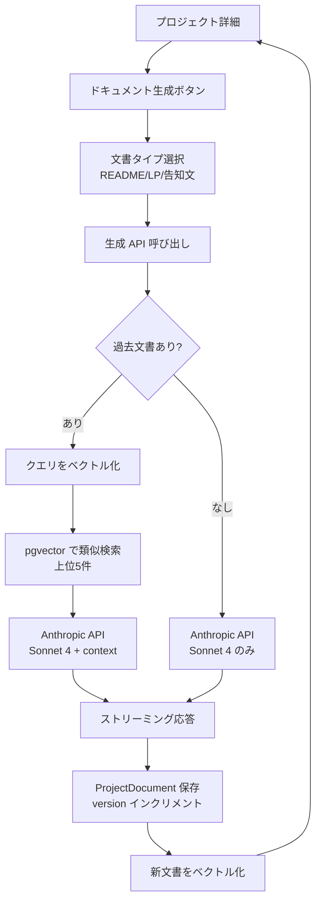

# 画面遷移図

## 概要

Shipyard の主要なユーザーフローを画面遷移図で示す。MVP 範囲のフローのみ記載し、将来追加機能は別途追記する。

## URL 構造

ADR-003 のサブパス方式に基づく URL 体系。

| パターン | 例 | 用途 |
|---|---|---|
| `/` | shipyard.app/ | ランディングページ |
| `/sign-in` | shipyard.app/sign-in | ログイン |
| `/sign-up` | shipyard.app/sign-up | サインアップ |
| `/onboarding` | shipyard.app/onboarding | 初回ワークスペース作成 |
| `/w` | shipyard.app/w | ワークスペース一覧 |
| `/w/{slug}` | shipyard.app/w/devlog | ワークスペースダッシュボード |
| `/w/{slug}/projects/{id}` | shipyard.app/w/devlog/projects/abc | プロジェクト詳細 |
| `/w/{slug}/settings` | shipyard.app/w/devlog/settings | ワークスペース設定 |
| `/w/{slug}/billing` | shipyard.app/w/devlog/billing | 課金管理 |
| `/invite/{token}` | shipyard.app/invite/xyz | 招待受諾 |

## フロー1: オンボーディング(初回サインアップ)

```mermaid
flowchart TD
    Start([新規ユーザー]) --> LP[ランディングページ<br/>/]
    LP --> SignUp[サインアップ画面<br/>/sign-up]
    SignUp -->|Clerk経由| EmailVerify[メール認証]
    EmailVerify --> Onboarding[ワークスペース作成<br/>/onboarding]
    Onboarding --> InputSlug[ワークスペース名・slug 入力]
    InputSlug --> SlugCheck{slug 利用可能?}
    SlugCheck -->|NG| InputSlug
    SlugCheck -->|OK| CreateWS[ワークスペース作成<br/>API 呼び出し]
    CreateWS --> Dashboard[ダッシュボード<br/>/w/&#123;slug&#125;]
    Dashboard --> End([完了])
```



### 設計ポイント

- Clerk のサインアップ完了後に Webhook で User レコードを DB に作成
- ワークスペース作成と同時に TenantMember(role=OWNER)を作成
- slug 重複チェックは API 側で行う(リアルタイム validation)

## フロー2: プロジェクト作成と AI 競合調査

```mermaid
flowchart TD
    Dashboard[ダッシュボード<br/>/w/&#123;slug&#125;] --> ClickNew[新規プロジェクトボタン]
    ClickNew --> NewProject[プロジェクト作成画面]
    NewProject --> InputIdea[アイデア入力<br/>名前・説明]
    InputIdea --> SaveProject[プロジェクト保存<br/>status=IDEA]
    SaveProject --> ProjectDetail[プロジェクト詳細<br/>/w/&#123;slug&#125;/projects/&#123;id&#125;]
    ProjectDetail --> ChooseAction{次のアクション?}
    ChooseAction -->|競合調査| Research[AI 競合調査]
    ChooseAction -->|チェックリスト生成| Checklist[AI チェックリスト]
    ChooseAction -->|ドキュメント生成| Doc[ドキュメント生成(AI 支援)]
    Research --> StreamResearch[ストリーミング表示<br/>競合プロダクト一覧]
    StreamResearch --> SaveResearch[結果を ProjectDocument 保存]
    SaveResearch --> ProjectDetail
    Checklist --> SelectType[プロジェクトタイプ選択<br/>Web/CLI/拡張機能等]
    SelectType --> GenChecklist[AI チェックリスト生成<br/>Tool Use]
    GenChecklist --> ProjectDetail
```

### 設計ポイント

- 競合調査は時間がかかる(数十秒) → BullMQ で非同期化、SSE でストリーミング表示
- チェックリスト生成は Haiku 4.5 + Tool Use で高速化(数秒)
- AI 機能利用時は AIUsage テーブルに記録、Free プランの上限チェック

## フロー3: メンバー招待

```mermaid
flowchart TD
    Settings[ワークスペース設定<br/>/w/&#123;slug&#125;/settings] --> ClickInvite[メンバー招待ボタン]
    ClickInvite --> InputEmail[メールアドレス・ロール入力]
    InputEmail --> CheckPlan{Free プラン<br/>3人未満?}
    CheckPlan -->|超過| UpgradePrompt[プラン超過案内]
    CheckPlan -->|OK| CreateToken[InvitationToken 作成]
    CreateToken --> SendEmail[招待メール送信<br/>SES経由]
    SendEmail --> WaitAccept[受諾待ち]
    WaitAccept --> InviteeOpen[被招待者がリンク開封<br/>/invite/&#123;token&#125;]
    InviteeOpen --> InviteeAuth{認証済み?}
    InviteeAuth -->|未認証| InviteeSignUp[サインアップ・ログイン]
    InviteeSignUp --> InviteeAccept
    InviteeAuth -->|認証済み| InviteeAccept[招待受諾画面]
    InviteeAccept --> AcceptAPI[受諾 API<br/>TenantMember 作成]
    AcceptAPI --> WSDashboard[ワークスペースダッシュボード]
    UpgradePrompt --> Billing[課金管理画面]
```



### 設計ポイント

- InvitationToken は 7 日で有効期限切れ
- 招待時にロールを指定(OWNER 以外を選択可)
- 同じメールへの重複招待は既存トークンを更新
- Free プランの 3 人制限はサーバ側で検証

## フロー4: 課金アップグレード(Stripe Checkout)

```mermaid
flowchart TD
    Trigger[アップグレードトリガー<br/>UI ボタン or プラン超過] --> BillingPage[課金管理画面<br/>/w/&#123;slug&#125;/billing]
    BillingPage --> SelectPlan[プラン選択<br/>Pro / Team]
    SelectPlan --> CallAPI[Checkout Session 作成 API]
    CallAPI --> CreateSession[Stripe Checkout<br/>Session 作成]
    CreateSession --> Redirect[Stripe にリダイレクト]
    Redirect --> StripePay[カード情報入力<br/>Stripe ホスト画面]
    StripePay --> PaymentResult{決済結果}
    PaymentResult -->|成功| StripeSuccess[Stripe Success URL]
    PaymentResult -->|キャンセル| StripeCancel[Stripe Cancel URL]
    StripeSuccess --> Webhook[checkout.session.completed<br/>Webhook 受信]
    Webhook --> UpdateSub[Subscription 更新<br/>plan=PRO]
    UpdateSub --> SuccessPage[アップグレード完了画面<br/>/w/&#123;slug&#125;/billing]
    StripeCancel --> BillingPage
```



### 設計ポイント

- Stripe Checkout Session に `success_url` と `cancel_url` を指定
- 成功画面に戻った時点では Webhook 未着の可能性があるため、画面側でポーリングまたは「処理中」表示
- Webhook の Idempotency Key は `event.id` を WebhookEvent テーブルにユニーク保存

## フロー5: ドキュメント生成(AI 支援)と RAG 検索



### 設計ポイント

- 既存の ProjectDocument(同 tenant の他プロジェクト含む)からの RAG で「自分の過去」を活かす
- バージョン管理で推敲履歴を残す(v1, v2, v3...)
- 生成完了後に新ドキュメントを Embedding 化して次回以降の RAG 対象に追加

## フロー6: ワークスペース切替

```mermaid
flowchart LR
    AnyPage[任意のページ] --> Switcher[ワークスペース切替メニュー]
    Switcher --> List[所属ワークスペース一覧]
    List --> Select[ワークスペース選択]
    Select --> Navigate[/w/&#123;newSlug&#125; に遷移]
    Navigate --> ChangeContext[middleware で<br/>tenant context 更新]
    ChangeContext --> NewDashboard[新ワークスペースの<br/>ダッシュボード]
```

### 設計ポイント

- ワークスペース一覧は Clerk Organizations API ではなく自前 DB から取得
- middleware で URL の slug を解析し、ユーザーが所属しているか検証
- 所属していない slug アクセスは 404 を返す(存在の有無を漏らさないため)

## モバイル対応の方針

- **MVP 段階**: 主要画面のみレスポンシブ対応(ダッシュボード、プロジェクト詳細、AI 機能)
- **対象外**: 設定・課金管理画面の細かい挙動はデスクトップ前提で OK
- **将来**: PWA 化、ネイティブアプリ化は需要次第

## 主要な遷移以外のフロー(MVP 範囲外)

以下は MVP では実装せず、Week 4 以降に追加する:

- パスワードリセット(Clerk が自動対応)
- メールアドレス変更
- ワークスペース削除
- アカウント削除(GDPR 対応)
- 監査ログ画面(Team プランの機能)
- カスタムドメイン設定

## フォローアップ

- 各画面のワイヤーフレーム作成(Figma)
- shadcn/ui のコンポーネント選定
- アクセシビリティ対応(キーボードナビゲーション、ARIA)
